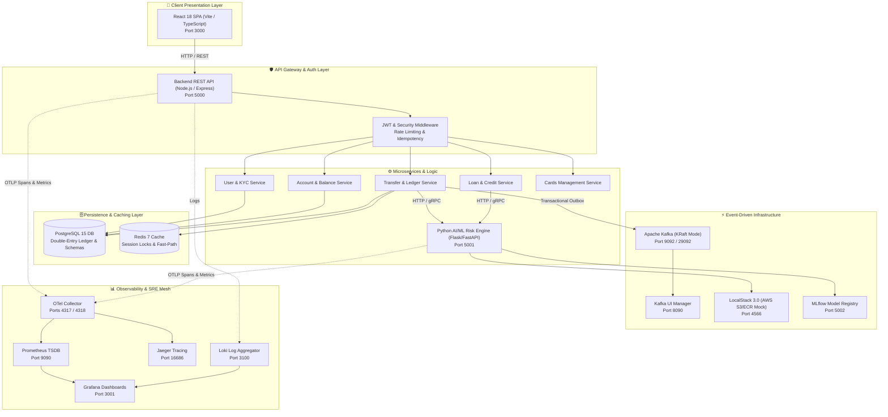
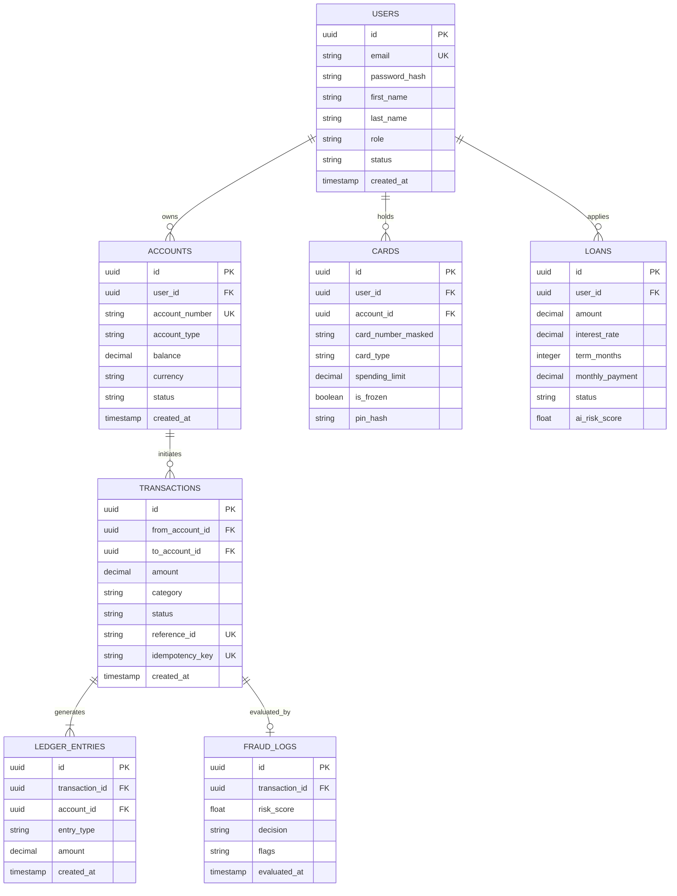
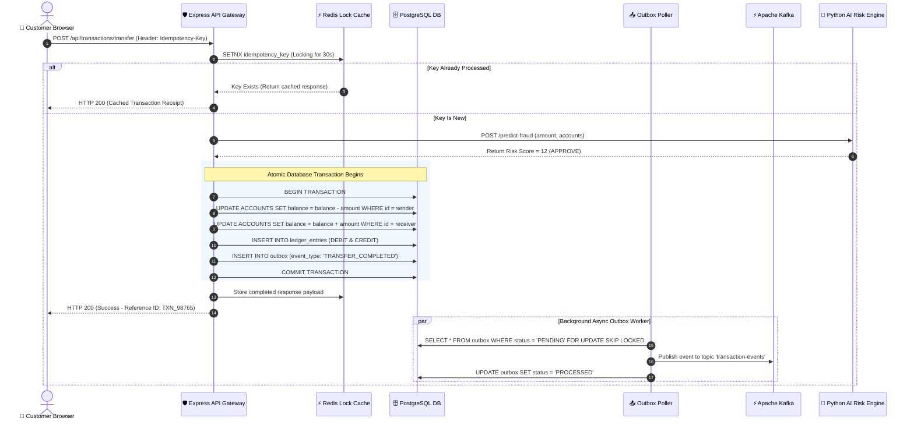
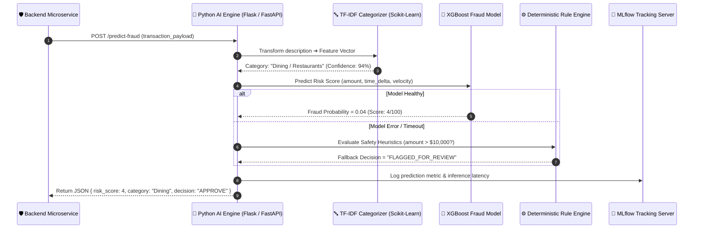
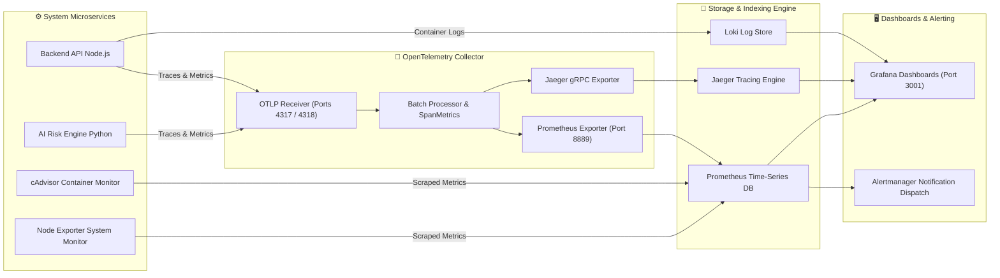
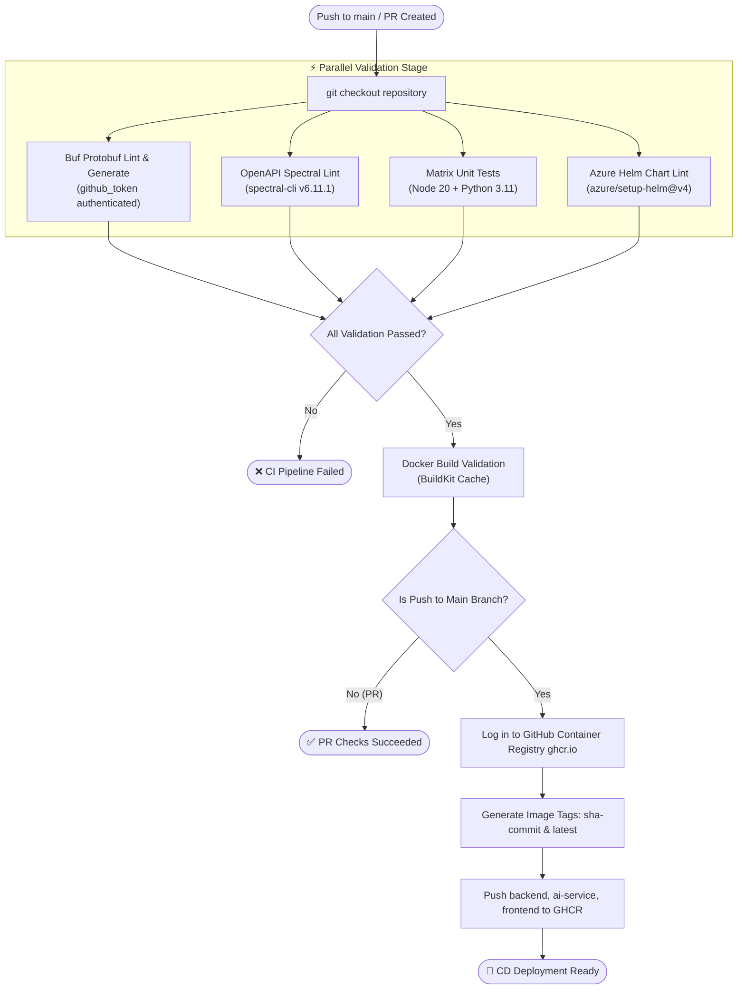
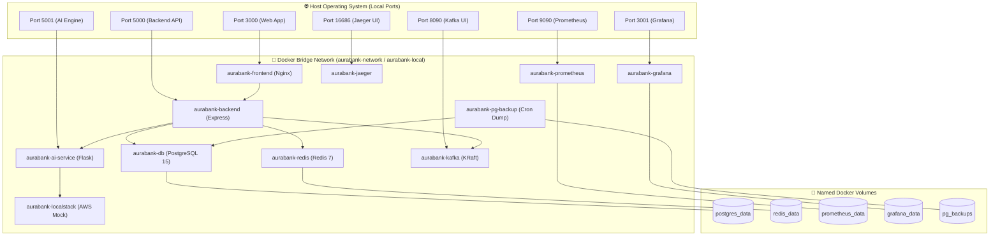

# 📐 AuraBank — Full Project Architecture & System Diagrams

**Comprehensive visual engineering blueprint featuring end-to-end Mermaid diagrams for Microservices, Double-Entry Accounting Ledger ERD, Transaction Data Flow, AI/ML Inference Pipeline, OpenTelemetry Observability Mesh, and GitOps CI/CD.**

---

## 📑 Table of Contents
1. [🏗️ 1. High-Level Microservices System Architecture](#️-1-high-level-microservices-system-architecture)
2. [🗄️ 2. Database & Double-Entry Ledger Entity Relationship Diagram (ERD)](#️-2-database--double-entry-ledger-entity-relationship-diagram-erd)
3. [💸 3. Money Transfer & Transactional Outbox Sequence Diagram](#-3-money-transfer--transactional-outbox-sequence-diagram)
4. [🤖 4. AI Fraud & ML Risk Scoring Pipeline Sequence Diagram](#-4-ai-fraud--ml-risk-scoring-pipeline-sequence-diagram)
5. [📊 5. OpenTelemetry Observability & Telemetry Mesh Diagram](#-5-opentelemetry-observability--telemetry-mesh-diagram)
6. [🔄 6. CI/CD Automated Build & Deployment Flowchart](#-6-cicd-automated-build--deployment-flowchart)
7. [🐳 7. Docker Container Network & Storage Topology](#-7-docker-container-network--storage-topology)

---

## 🏗️ 1. High-Level Microservices System Architecture

This diagram illustrates the complete domain-decoupled microservices architecture of AuraBank, showing how traffic flows from the browser SPA down to microservices, databases, event streaming, and monitoring layers.

---

## 🗄️ 2. Database & Double-Entry Ledger Entity Relationship Diagram (ERD)

AuraBank uses strict **double-entry bookkeeping** where every transaction creates balanced debit and credit entries (`DEBIT + CREDIT = 0`).

---

## 💸 3. Money Transfer & Transactional Outbox Sequence Diagram

This sequence diagram demonstrates what happens during a user transfer: from client request, idempotency verification, PostgreSQL transaction commit, transactional outbox publishing to Kafka, and async notification.

---

## 🤖 4. AI Fraud & ML Risk Scoring Pipeline Sequence Diagram

This diagram shows how the Python AI Engine processes incoming fraud check requests, extracts feature sets, applies machine learning models (XGBoost & Scikit-Learn TF-IDF), and logs feedback data for retraining.

---

## 📊 5. OpenTelemetry Observability & Telemetry Mesh Diagram

Full observability mesh showing how metrics, logs, and distributed traces are collected, aggregated, and visualized across Grafana, Prometheus, Jaeger, and Loki.

---

## 🔄 6. CI/CD Automated Build & Deployment Flowchart

GitHub Actions pipeline flow showing automated linting, test matrices, Docker image build validation, and automated publishing to GitHub Container Registry (`ghcr.io`).

---

## 🐳 7. Docker Container Network & Storage Topology

Shows the isolated bridge networks, host port bindings, and volume mounts defined across `docker-compose.yml` and `docker-compose.local.yaml`.

---

**AuraBank Visual Architecture Reference** • Maintained by [@9046balaji](https://github.com/9046balaji)

