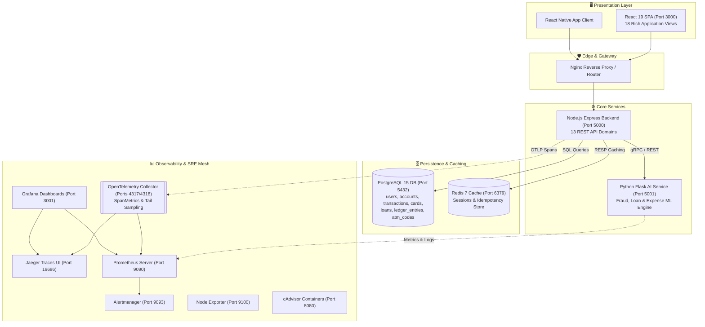

# 🏦 Aura Bank - Integrated Enterprise Fintech Ecosystem

<div align="center">


**Production-Grade Containerized Banking Ecosystem with Double-Entry Accounting, Real-Time AI Risk Scoring, OpenTelemetry Tracing & Full Observability**

[](https://react.dev/)
[](https://www.typescriptlang.org/)
[](https://nodejs.org/)
[](https://www.postgresql.org/)
[](https://www.python.org/)
[](https://opentelemetry.io/)
[](https://www.docker.com/)
[](https://prometheus.io/)
[](https://grafana.com/)
[](https://www.jaegertracing.io/)

[System Architecture](#-system-architecture) • [Application Views Catalog](#-application-views-catalog) • [Double-Entry Ledger](#-double-entry-accounting-ledger) • [Observability Stack](#-observability--monitoring-stack) • [Quick Start](#-quick-start--deployment) • [Microservices Migration Plan](#-microservices-migration-roadmap)

</div>

---

## 📖 Executive Summary

**Aura Bank** is an enterprise-grade digital banking and financial management ecosystem built with modern cloud-native architectures. The platform integrates:
- **Strict Double-Entry Bookkeeping**: Mathematical zero-sum accounting (`DEBIT + CREDIT = 0`) preventing balance drifts.
- **AI & Risk Engine**: Scikit-learn models for real-time transaction fraud scoring, loan credit evaluation, and online re-trainable expense categorization.
- **Cardless ATM Withdrawals**: 6-digit cryptographic token generation (`atm_codes`) for cardless cash pickup.
- **Credit & Debit Card Management**: Dynamic limit controls, card freeze/unfreeze, PIN resetting, and rewards calculations.
- **Full SRE & Observability Suite**: OpenTelemetry Collector gateway, Jaeger distributed tracing, Prometheus metrics, Grafana dashboards, Alertmanager, cAdvisor, and Node Exporter.
- **DevOps + AI Architecture Plan**: Clear 5-phase migration roadmap from monolithic architecture to AWS EKS microservices with GitOps (ArgoCD) and Transactional Outbox pattern.

---

## 🏗️ System Architecture



---

## 📱 Application Views Catalog (`views/`)

The platform contains 18 comprehensive user & admin views:

| View File | Audience | Key Capabilities & Description |
| :--- | :--- | :--- |
| **`Landing.tsx`** | Public | Marketing landing page showcasing features, security certifications, and CTA buttons. |
| **`Auth.tsx`** | Public | 3D interactive authentication wizard (Register, Login, Password Reset, Role Toggle). |
| **`KYC.tsx`** | Customer | Customer identity verification, SSN/ID upload, 4-digit PIN setup, initial account allocation. |
| **`Dashboard.tsx`** | Customer | Main financial command center: account balance cards, recent activity, quick action drawer. |
| **`ManageFunds.tsx`** | Customer | Cash deposit, withdrawal, cardless ATM code generation, and beneficiary quick transfer. |
| **`Transfer.tsx`** | Customer | Inter-bank & P2P wire transfers, idempotency key verification, downloadable digital receipts. |
| **`Cards.tsx`** | Customer | Debit/credit card manager: physical card freeze/unfreeze, limit changes, PIN reset, rewards tracking. |
| **`Loans.tsx`** | Customer | Active loan tracker, EMI repayment schedule viewer, loan application wizard with AI scoring. |
| **`Analytics.tsx`** | Customer | Interactive financial charts, spending category breakdown, monthly cashflow projections. |
| **`Support.tsx`** | Customer | Customer support desk: ticket creation, comment threads, public FAQs, live chat trigger. |
| **`Profile.tsx`** | Customer | User profile editor, avatar update, security preferences, multi-channel notification toggles. |
| **`AdminOverview.tsx`** | Admin | Executive banking dashboard: system deposits, active user count, total transaction volume. |
| **`AdminCardApprovals.tsx`** | Admin | Card issuance review desk: approve/reject credit card applications and limits. |
| **`AdminLoanApprovals.tsx`** | Admin | Loan approval desk: review AI risk scores (0-100), DTI ratios, credit scores, approve/reject. |
| **`AdminPaymentTracking.tsx`** | Admin | Real-time transaction surveillance: monitor transfers, search by reference ID, inspect fraud flags. |
| **`AdminFeedback.tsx`** | Admin | Customer feedback manager: review 1-5 star ratings, respond to inquiries, toggle public testimonials. |
| **`AdminChat.tsx`** | Admin | Staff live chat console: real-time messaging workspace for supporting customer inquiries. |
| **`AdminSystemConfig.tsx`** | Admin | System parameters manager: toggle maintenance mode, set daily transfer limits, adjust interest rates. |

---

## 🏦 Double-Entry Accounting Ledger

Aura Bank enforces strict **double-entry bookkeeping** on every financial transaction:
$$\sum \text{DEBIT} + \sum \text{CREDIT} = 0$$

### System Ledger Accounts
- `00000000-0000-0000-0000-000000000001` -> **`BANK_CASH`** (Main Cash Reserve)
- `00000000-0000-0000-0000-000000000002` -> **`BANK_REVENUE`** (Interest & Fee Income)
- `00000000-0000-0000-0000-000000000003` -> **`BANK_FEES`** (Transaction Fees Collected)
- `00000000-0000-0000-0000-000000000004` -> **`SUSPENSE`** (Temporary Pending Holding)
- `00000000-0000-0000-0000-000000000005` -> **`BANK_LOANS`** (Outstanding Loan Principal)

---

## 🤖 AI & Machine Learning Microservice (`ai-service/`)

The Python Flask AI Service (`app.py`) exposes advanced ML & NLP capabilities:
1. **Real-Time Fraud Detection** (`/predict-fraud`): Calculates fraud probability scores (0-100) and recommendation flags (`APPROVE`, `FLAG`, `REJECT`).
2. **AI Loan Risk Evaluator** (`/predict-loan-risk`): Evaluates monthly income, credit score, DTI ratio, and computes safe loan eligibility.
3. **Expense Categorizer** (`/categorize-expense`): Scikit-learn TF-IDF + Logistic Regression model auto-labeling transactions into 9 spending categories with online feedback re-training (`/feedback/category-correction`).
4. **AI Banking Chat Assistant** (`/chat`): Natural language financial queries and spending analysis.

---

## 📊 Observability & SRE Stack

The project features a comprehensive **OpenTelemetry Collector + Jaeger + Prometheus + Grafana** telemetry mesh:

| Service | Access URL | Credentials / Notes |
| :--- | :--- | :--- |
| **Banking Web SPA** | [http://localhost:3000](http://localhost:3000) | Frontend React Application |
| **Backend REST API** | [http://localhost:5000](http://localhost:5000) | Express Node.js API |
| **AI ML Service** | [http://localhost:5001](http://localhost:5001) | Flask AI Microservice |
| **Jaeger Distributed Tracing** | [http://localhost:16686](http://localhost:16686) | OTel Trace Visualizer |
| **Grafana Dashboards** | [http://localhost:3001](http://localhost:3001) | User: `admin` / Password: `admin` |
| **Prometheus Metrics** | [http://localhost:9090](http://localhost:9090) | PromQL Metrics Browser |
| **OTel Collector Metrics** | [http://localhost:8889](http://localhost:8889) | OTel SpanMetrics Exporter |
| **Alertmanager** | [http://localhost:9093](http://localhost:9093) | Alert Status Management |
| **cAdvisor Metrics** | [http://localhost:8080](http://localhost:8080) | Container Resource Monitor |

---

## 🗺️ Microservices Migration Roadmap

For the full **DevOps + AI Microservices Engineering Blueprint**, refer to:
- **[monoloth_to_microservice.md](monoloth_to_microservice.md)**: Master plan detailing AWS EKS deployment, Terraform IaC, ArgoCD GitOps, Transactional Outbox pattern, and 5-phase incremental roadmap.
- **[devops_ai_resume_showcase_guide.md](devops_ai_resume_showcase_guide.md)**: Resume bullet points, system design interview Q&A scenarios, and portfolio setup.

---

## ⚡ Quick Start (Docker Compose)

```bash
# 1. Clone repository
git clone https://github.com/9046balaji/bank-management-system.git
cd "bank management system"

# 2. Launch full container stack
docker-compose up -d --build

# 3. Verify health
docker-compose ps
```

---

<div align="center">

Developed with ❤️ by **[@9046balaji](https://github.com/9046balaji)**

</div>
