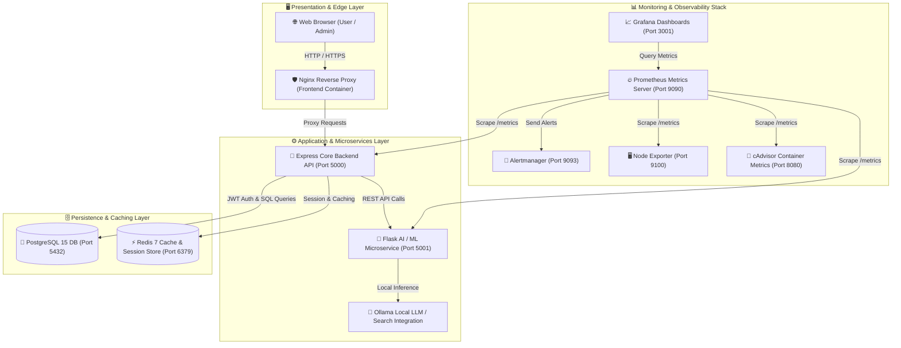
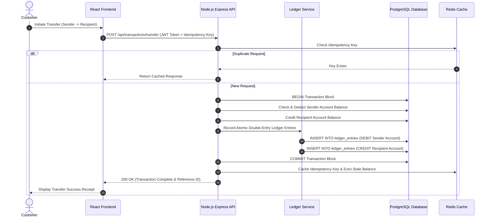
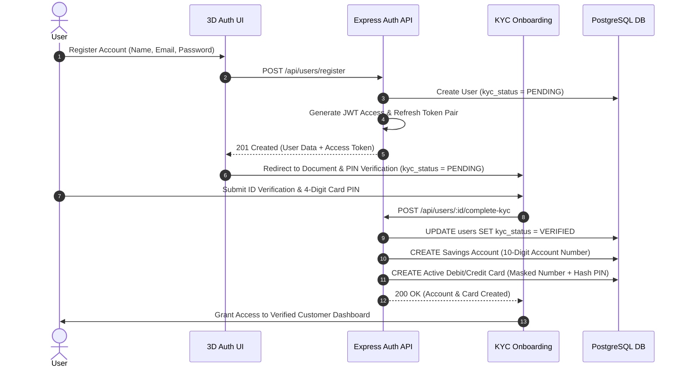
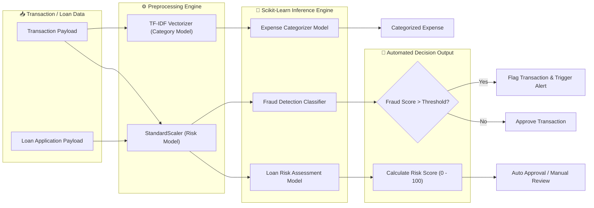
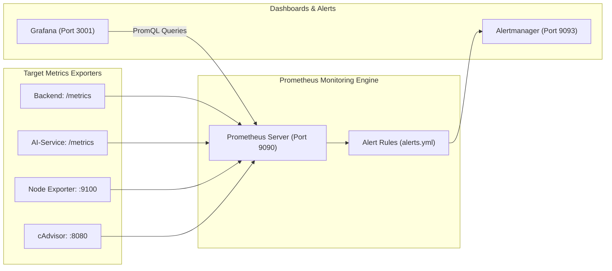

# 🏦 Aura Bank - Integrated Enterprise Fintech Ecosystem

<div align="center">


**Production-Grade Containerized Banking Ecosystem with Double-Entry Accounting, Real-Time AI Risk Scoring & Full Observability**

[](https://react.dev/)
[](https://www.typescriptlang.org/)
[](https://nodejs.org/)
[](https://www.postgresql.org/)
[](https://www.python.org/)
[](https://www.docker.com/)
[](https://prometheus.io/)
[](https://grafana.com/)

[System Architecture](#-system-architecture) • [Microservices Overview](#-microservices-overview) • [Double-Entry Ledger](#-double-entry-accounting-ledger) • [Observability Stack](#-observability--monitoring-stack) • [Quick Start](#-quick-start--deployment) • [API Matrix](#-api-endpoints-reference)

</div>

---

## 📖 Executive Summary

**Aura Bank** is an enterprise-grade, microservices-based digital banking and fintech management ecosystem. Designed following modern cloud-native architectures, Aura Bank integrates **strict double-entry financial accounting**, **real-time ML risk scoring & fraud detection**, **Ollama LLM AI chat support**, and **full Prometheus/Grafana observability** in a containerized environment.

### Core Capabilities
* **Double-Entry General Ledger**: Immutable, atomic financial bookkeeping supporting debit/credit balance reconciliation.
* **AI-Powered Risk Engine**: Real-time loan risk scoring, credit limit assessment, and expense classification powered by scikit-learn models.
* **Full-Stack Security**: JWT access/refresh token pair lifecycle, bcrypt password hashing, input validation via Zod, rate limiting, and idempotency protection.
* **3D Interactive Onboarding**: Immersive Three.js 3D user authentication & KYC verification workflows.
* **Enterprise Observability**: Native Prometheus metrics endpoints across all microservices, Grafana dashboards, Alertmanager integration, and cAdvisor/Node Exporter system tracking.

---

## 🏗️ System Architecture

Aura Bank operates as a microservices application decoupled across distinct network domains, orchestrated via Docker Compose.

### 1. High-Level Enterprise Architecture



---

### 2. Double-Entry Ledger Transaction Flow



---

### 3. Authentication & KYC Onboarding Workflow



---

### 4. AI Machine Learning & Fraud Inspection Pipeline



---

## 🛠️ Microservices Architecture Overview

| Microservice | Technology Stack | Port | Primary Responsibility |
| :--- | :--- | :--- | :--- |
| **`frontend`** | React 19, TypeScript, Vite, Nginx | `3000` | User dashboard, 3D login experience, loan application, admin panel, analytics. |
| **`backend`** | Node.js, Express, TypeScript, pg | `5000` | REST API Gateway, double-entry ledger execution, user session control, transaction management. |
| **`ai-service`** | Python 3.11, Flask, scikit-learn | `5001` | ML inference for fraud detection, credit scoring, transaction categorization, Ollama integration. |
| **`db`** | PostgreSQL 15 Alpine | `5432` | Relational persistence, UUID keys, foreign key cascades, atomic transactions. |
| **`redis`** | Redis 7 Alpine | `6379` | High-speed in-memory cache, rate-limiting store, session cache. |
| **`prometheus`** | Prometheus v2.49.1 | `9090` | Metrics collection engine, scraping endpoints every 15 seconds. |
| **`grafana`** | Grafana 10.3.1 | `3001` | Dashboard visualization for container health, API latency, database metrics. |
| **`alertmanager`**| Alertmanager v0.26.0 | `9093` | Alert routing and notifications for system anomalies. |
| **`node-exporter`**| Node Exporter v1.7.0 | `9100` | Host hardware and OS metric collector. |
| **`cadvisor`** | cAdvisor v0.47.2 | `8080` | Real-time container resource utilization monitoring. |

---

## 💼 Double-Entry Accounting Ledger

Aura Bank implements a strict **double-entry bookkeeping system** to ensure compliance with financial accounting standards. Every monetary transaction generates equal and opposite **DEBIT** and **CREDIT** entries.

### System Ledger Accounts
```sql
-- Core System Ledger Accounts
'00000000-0000-0000-0000-000000000001' -> BANK_CASH     (Main Bank Cash Reserve)
'00000000-0000-0000-0000-000000000002' -> BANK_REVENUE  (Interest & Fee Income)
'00000000-0000-0000-0000-000000000003' -> BANK_FEES     (Transaction Fees Collected)
'00000000-0000-0000-0000-000000000004' -> SUSPENSE      (Temporary Pending Holding)
'00000000-0000-0000-0000-000000000005' -> BANK_LOANS    (Outstanding Loan Principal)
```

### Ledger Entry Schema
```sql
CREATE TABLE ledger_entries (
    id UUID PRIMARY KEY DEFAULT gen_random_uuid(),
    transaction_id UUID NOT NULL,
    ledger_account_id UUID NOT NULL REFERENCES ledger_accounts(id),
    entry_type VARCHAR(10) NOT NULL CHECK (entry_type IN ('DEBIT', 'CREDIT')),
    amount DECIMAL(15, 2) NOT NULL CHECK (amount > 0),
    signed_amount DECIMAL(15, 2) GENERATED ALWAYS AS (
      CASE WHEN entry_type = 'DEBIT' THEN amount ELSE -amount END
    ) STORED,
    running_balance DECIMAL(15, 2),
    created_at TIMESTAMP DEFAULT CURRENT_TIMESTAMP
);
```

---

## 📊 Observability & Monitoring Stack

The ecosystem includes a complete **Prometheus & Grafana observability pipeline** configured out-of-the-box.



### Available Dashboards (Grafana)
- **Container Health & Metrics**: CPU, memory usage, network I/O per container via cAdvisor.
- **Node Infrastructure**: Disk space, load average, RAM utilization via Node Exporter.
- **API Performance**: HTTP request rates, response latency breakdown (p50, p95, p99), error rates.

---

## ⚡ Quick Start & Deployment

### Prerequisites
* [Docker Desktop](https://www.docker.com/products/docker-desktop/) (with WSL2 backend on Windows or native Linux Docker Engine)
* Node.js 20+ (for optional local non-containerized development)

---

### 1. One-Command Launch (Docker Compose)

```bash
# Clone repository
git clone https://github.com/9046balaji/bank-management-system.git
cd "bank management system"

# Launch entire microservices stack in background
docker-compose up -d --build
```

### 2. Verify Container Services Health

```bash
docker-compose ps
```

Expected output:
```text
NAME                    STATUS                 PORTS
aurabank-frontend       Up (healthy)           0.0.0.0:3000->80/tcp
aurabank-backend        Up (healthy)           0.0.0.0:5000->5000/tcp
aurabank-ai-service     Up (healthy)           0.0.0.0:5001->5001/tcp
aurabank-db             Up (healthy)           0.0.0.0:5432->5432/tcp
aurabank-redis          Up (healthy)           0.0.0.0:6379->6379/tcp
aurabank-prometheus     Up (healthy)           0.0.0.0:9090->9090/tcp
aurabank-grafana        Up (healthy)           0.0.0.0:3001->3000/tcp
aurabank-alertmanager   Up (healthy)           0.0.0.0:9093->9093/tcp
aurabank-node-exporter  Up (healthy)           0.0.0.0:9100->9100/tcp
aurabank-cadvisor       Up (healthy)           0.0.0.0:8080->8080/tcp
```

---

### 3. Application Access Endpoints

| Service | Access URL | Credentials / Notes |
| :--- | :--- | :--- |
| **Banking Frontend UI** | [http://localhost:3000](http://localhost:3000) | Customer & Admin Web Interface |
| **Backend REST API** | [http://localhost:5000](http://localhost:5000) | Express API Server |
| **AI ML Service** | [http://localhost:5001](http://localhost:5001) | Flask AI Risk & Fraud API |
| **Grafana Dashboards** | [http://localhost:3001](http://localhost:3001) | Username: `admin` / Password: `admin` |
| **Prometheus Metrics** | [http://localhost:9090](http://localhost:9090) | PromQL Metrics Browser |
| **Alertmanager** | [http://localhost:9093](http://localhost:9093) | Alert Status Management |
| **cAdvisor Metrics** | [http://localhost:8080](http://localhost:8080) | Container Metrics Engine |

---

## 📡 API Endpoints Reference

### 🔑 Authentication & Users (`/api/users`)
* `POST /api/users/register` - Create user account & issue JWT token pair.
* `POST /api/users/login` - Authenticate user & issue JWT token pair.
* `POST /api/users/:id/complete-kyc` - Verify KYC documents, allocate account number & issue active card.
* `GET /api/users/profile` - Fetch authenticated user profile.
* `POST /api/users/logout` - Invalidate session tokens.

### 💳 Accounts & Transactions (`/api/accounts`, `/api/transactions`)
* `GET /api/accounts/user/:userId` - Fetch accounts for specific user.
* `POST /api/transactions/transfer` - Perform instant transfer with idempotency & double-entry ledger.
* `GET /api/transactions/history/:accountId` - Paginated transaction logs.

### 🏦 Loans & Risk Assessment (`/api/loans`)
* `POST /api/loans/apply` - Submit loan application for automated AI risk scoring.
* `GET /api/loans/user/:userId` - List active loans & EMI schedules.
* `POST /api/loans/pay-emi` - Process loan EMI payment.

### 🤖 AI Machine Learning Engine (`http://localhost:5001`)
* `POST /predict-fraud` - Transaction fraud classification score.
* `POST /predict-loan-risk` - Credit score & loan risk analysis.
* `POST /categorize-expense` - Smart expense categorization.

---

## 📂 Repository Directory Structure

```text
bank-management-system/
├── 📁 .github/              # GitHub Action Workflows
├── 📁 ai-service/           # Python Flask ML Microservice
│   ├── app.py               # Flask REST Server & Inference Endpoints
│   ├── Dockerfile           # Python 3.11 Container Definition
│   └── requirements.txt     # Python ML Dependencies
├── 📁 backend/              # Node.js Express Backend Service
│   ├── src/
│   │   ├── controllers/     # Request Handlers
│   │   ├── db/              # Postgres Connection Pool & Auto-Migrations
│   │   ├── middleware/      # JWT Auth, Rate Limiter, Error Handling
│   │   ├── routes/          # Express API Endpoints
│   │   └── services/        # Double-Entry Ledger Service
│   └── Dockerfile           # Node 20 Alpine Build Container
├── 📁 components/           # Shared React Component Library
├── 📁 database/             # Relational Database Schema & Seeding
│   ├── schema.sql           # Core Database Tables & Indexes
│   ├── schema_updates.sql   # Auxiliary Tables & Functions
│   └── ledger_schema.sql    # Double-Entry Ledger Schema
├── 📁 monitoring/           # Observability Infrastructure Configs
│   ├── grafana/             # Dashboard Provisioning & Datasources
│   └── prometheus/          # Prometheus Target Configurations & Alerts
├── 📁 src/                  # React Frontend Source Code
├── 📁 views/                # Full Page View Components (Dashboard, Admin, etc.)
├── App.tsx                  # Primary React Application Component
├── docker-compose.yml       # Complete Multi-Container Orchestration Manifest
├── index.html               # Main Web Entrypoint
├── package.json             # Root Project Dependencies & Scripts
├── README.md                # Comprehensive Documentation
└── vite.config.ts           # Vite Build Configuration
```

---

## 📄 License

This project is licensed under the MIT License - see the [LICENSE](LICENSE) file for details.

---

<div align="center">

Developed with ❤️ by **[@9046balaji](https://github.com/9046balaji)**

**⭐ Star this repository if you find it helpful!**

</div>
