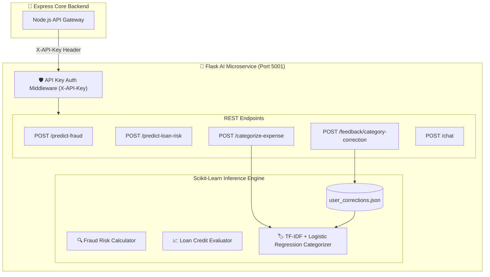

# 🤖 Aura Bank - AI & Machine Learning Microservice

<div align="center">


**Production-Grade AI Microservice for Real-Time Fraud Detection, Credit Risk Evaluation, Re-trainable Expense Categorization, and Financial Assistant API**

</div>

---

## 📖 Overview

The **Aura Bank AI Microservice** (`ai-service/app.py`) is a high-performance Python Flask service providing real-time Machine Learning and NLP intelligence to the banking ecosystem. It features:
- **Scikit-learn ML Pipelines**: TF-IDF Vectorizer + Logistic Regression models for transaction categorization.
- **Online Re-training Loop**: Captures user feedback corrections in `user_corrections.json` and dynamically updates model weights without downtime.
- **Security Middleware**: Mandates `X-API-Key` header verification for protected endpoints.
- **Native Prometheus Instrumentation**: Exposes `ai_service_requests_total`, `ai_service_request_latency_seconds`, and `ai_service_predictions_total` metrics.

---

## 🏗️ Architecture & Data Flow



---

## 📡 REST API Reference

### 1. Expense Categorization (`POST /categorize-expense`)
Auto-labels transaction text into 9 categories (*Food & Dining, Transportation, Shopping, Bills & Utilities, Entertainment, Healthcare, Education, Travel, Others*).
- **Request**:
  ```json
  {
    "description": "Starbucks Coffee #402"
  }
  ```
- **Response**:
  ```json
  {
    "category": "Food & Dining",
    "confidence": 0.95,
    "icon": "restaurant",
    "color": "#ef4444"
  }
  ```

### 2. User Feedback Correction (`POST /feedback/category-correction`)
Allows users to correct misclassified expenses and triggers online re-training.
- **Request**:
  ```json
  {
    "description": "Starbucks Coffee #402",
    "corrected_category": "Food & Dining"
  }
  ```
- **Response**:
  ```json
  {
    "status": "success",
    "message": "Correction saved and model updated",
    "total_corrections": 12
  }
  ```

### 3. Transaction Fraud Detection (`POST /predict-fraud`)
- **Request**:
  ```json
  {
    "amount": 4900.00,
    "user_id": "uuid-here",
    "location": "New York, USA"
  }
  ```
- **Response**:
  ```json
  {
    "fraud_score": 15.2,
    "risk_level": "LOW",
    "recommendation": "APPROVE"
  }
  ```

### 4. Loan Credit Risk Assessment (`POST /predict-loan-risk`)
- **Request**:
  ```json
  {
    "requested_amount": 25000,
    "monthly_income": 8500,
    "credit_score": 740
  }
  ```
- **Response**:
  ```json
  {
    "ai_risk_score": 18,
    "recommendation": "APPROVED",
    "max_safe_limit": 35000
  }
  ```

### 5. Health & Metrics
- **`GET /health`**: Returns service status, loaded model flags, and correction count.
- **`GET /metrics`**: Prometheus metrics endpoint (`ai_service_requests_total`, `ai_service_request_latency_seconds`).

---

## 🚀 Running & Testing Locally

```bash
cd ai-service

# Create virtual environment
python -m venv venv
source venv/bin/activate  # On Windows: venv\Scripts\activate

# Install dependencies
pip install -r requirements.txt

# Set optional API Key env variable
export AI_SERVICE_API_KEY="your_secret_key"

# Run Flask server on port 5001
python app.py
```

### Pytest Execution
```bash
pytest tests/
```
