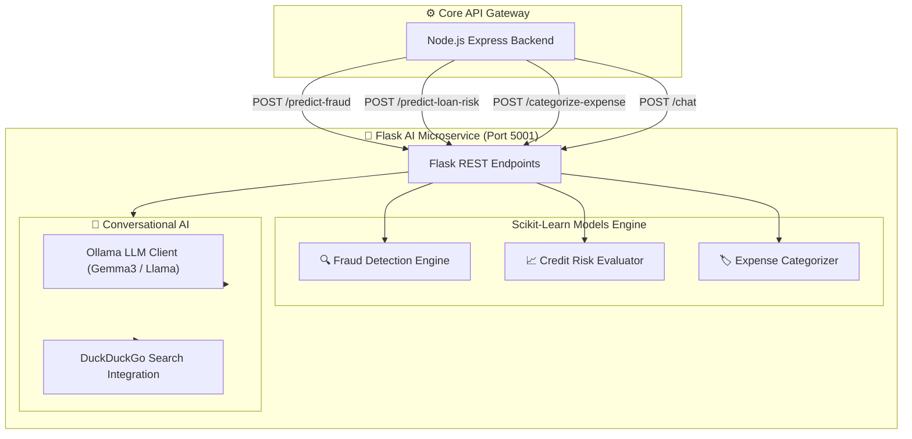

# 🤖 Aura Bank - AI & Machine Learning Microservice

<div align="center">


**High-Performance AI Service for Real-Time Fraud Detection, Loan Risk Assessment, Expense Categorization, and LLM Banking Chat**

</div>

---

## 📖 Overview

The **Aura Bank AI Microservice** is a specialized Python Flask application that provides intelligent analytical services to the banking ecosystem. It features custom scikit-learn Machine Learning pipelines for fraud detection, automated credit risk evaluation, transaction expense classification, and integration with local Ollama LLMs and DuckDuckGo search for conversational banking assistance.

---

## 🏗️ Service Architecture



---

## ✨ Features & ML Models

| Feature | Model / Algorithm | Description |
| :--- | :--- | :--- |
| 🔍 **Fraud Detection** | Decision Tree / Random Forest Classifier | Evaluates transaction velocity, geographical anomalies, and transfer amount variance to return a fraud score (0 - 100%). |
| 📈 **Loan Risk Assessment** | Gradient Boosting / Logistic Regression | Analyzes Debt-to-Income (DTI) ratios, credit scores, employment status, and monthly income to compute risk percentage and loan decision recommendation. |
| 🏷️ **Expense Categorization** | TF-IDF + Multinomial Naive Bayes | Categorizes transaction descriptions (e.g., "Starbucks", "Uber", "Amazon") into standard spending categories. |
| 💬 **AI Banking Assistant** | Ollama LLM + Live Search RAG | Answers customer banking questions, explains financial terms, and performs live web search for financial news. |

---

## 📡 REST API Endpoints Reference

### 1. Fraud Detection Endpoint
* **`POST /predict-fraud`**
  ```json
  // Request Payload
  {
    "amount": 2500.00,
    "user_id": "9bafafeb-c117-4d0d-a8a8-0d897b841942",
    "location": "New York, USA",
    "device": "Mobile iOS"
  }
  ```
  ```json
  // Response Payload (200 OK)
  {
    "success": true,
    "is_fraud": false,
    "risk_score": 12.5,
    "recommendation": "APPROVE"
  }
  ```

### 2. Loan Risk Assessment Endpoint
* **`POST /predict-loan-risk`**
  ```json
  // Request Payload
  {
    "requested_amount": 15000,
    "monthly_income": 6500,
    "credit_score": 720,
    "employment_status": "FULL_TIME"
  }
  ```
  ```json
  // Response Payload (200 OK)
  {
    "success": true,
    "risk_score": 18,
    "recommendation": "APPROVED",
    "max_eligible_amount": 25000
  }
  ```

### 3. Expense Categorization Endpoint
* **`POST /categorize-expense`**
  ```json
  // Request Payload
  {
    "description": "Starbucks Coffee #402"
  }
  ```
  ```json
  // Response Payload (200 OK)
  {
    "success": true,
    "category": "Food & Dining",
    "confidence": 0.94
  }
  ```

### 4. Conversational AI Chat Endpoint
* **`POST /chat`**
  ```json
  // Request Payload
  {
    "message": "What is the current savings account interest rate?",
    "history": []
  }
  ```

### 5. Health & Prometheus Metrics
* **`GET /health`**: Returns `{"status": "healthy"}`
* **`GET /metrics`**: Exposes Prometheus metrics (`http_requests_total`, `inference_latency_seconds`).

---

## 🚀 Local Setup & Testing

### Running Locally with Python
```bash
cd ai-service

# Create virtual environment
python -m venv venv
source venv/bin/activate  # On Windows: venv\Scripts\activate

# Install dependencies
pip install -r requirements.txt

# Start Flask development server (port 5001)
python app.py
```

### Running Pytest Suite
```bash
pytest tests/
```

---

## 🐳 Docker Deployment

The microservice is containerized using `python:3.11-slim` and served via Gunicorn WSGI server.

```bash
# Build image
docker build -t aurabank-ai-service ./ai-service

# Run container
docker run -d -p 5001:5001 --name aurabank-ai-service aurabank-ai-service
```
