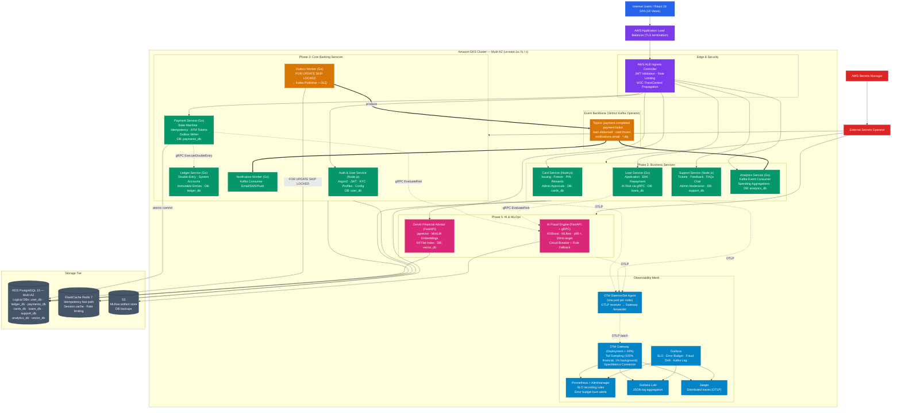
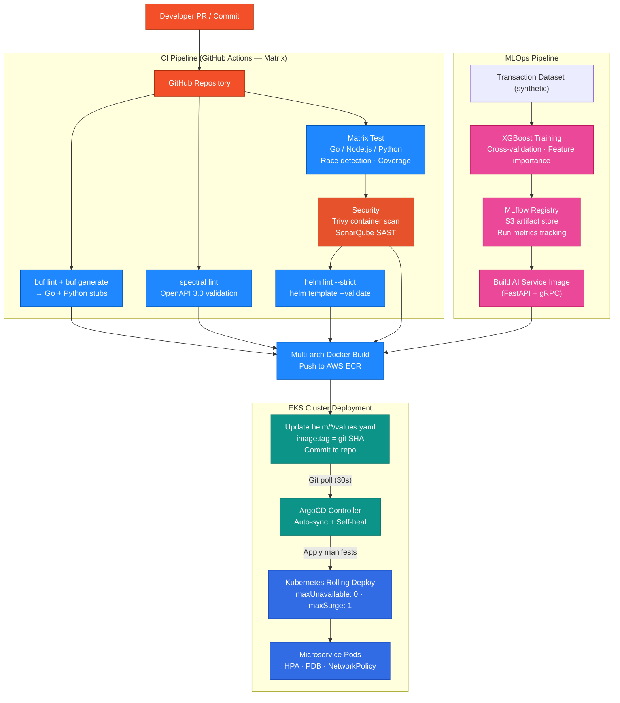

# Comprehensive Technical Architecture Report: AuraBank DevOps + AI Platform
> **Version 2.0 — Fixed: Secret Management, Ingress Clarification, Analytics DB isolation, AI Migration Path**

## 1. Executive Summary & Architectural Vision

This document provides the full technical architecture report for transforming the **AuraBank Bank Management System** from a monolithic Node.js application into an **AWS EKS Cloud-Native DevOps + AI Platform**.

Designed to be a **flagship resume & interview project for DevOps / SRE / MLOps Engineers**, this architecture integrates:
- **Complete Monolithic Domain Extraction**: All 18 UI views, 13 Express route modules, double-entry ledger, and Python ML capabilities mapped to isolated microservices.
- **Core Engineering Patterns**: Transactional Outbox Pattern (concurrent-safe `FOR UPDATE SKIP LOCKED`), Authoritative PostgreSQL `UNIQUE(idempotency_key)`, gRPC Protobuf Contracts, Versioned Schema Migrations (`golang-migrate`), Kafka DLQ & Retries.
- **Single Technology Stack**: AWS EKS, Terraform, ArgoCD, GitHub Actions, Go, Node.js (TypeScript), Python (FastAPI + gRPC), PostgreSQL 15, Kafka (Strimzi), Redis, OTel Agent+Gateway, Prometheus, Jaeger, Loki, Grafana, pgvector, MLflow, External Secrets Operator.
- **SRE & Production Hardening**: OTel DaemonSet+Gateway, Tail Sampling, NetworkPolicies, HPA+Karpenter, PodDisruptionBudgets, TopologySpreadConstraints, SLO recording rules, Error Budgets, LitmusChaos MTTR targets.
- **AI & MLOps Infrastructure**: FastAPI+gRPC Fraud Engine (XGBoost, target p95 < 10ms), MLflow (S3 artifact backend), Drift Alerts, PostgreSQL feedback corrections loop, GenAI RAG Financial Advisor (pgvector, sentence-transformers/all-MiniLM-L6-v2).

---

## 2. System Architecture Diagrams

### 2.1 Current Monolithic Architecture

```mermaid
graph TD
    classDef client fill:#3b82f6,color:white,stroke:#1d4ed8;
    classDef proxy fill:#8b5cf6,color:white,stroke:#6d28d9;
    classDef monolith fill:#f59e0b,color:white,stroke:#d97706;
    classDef aisvc fill:#10b981,color:white,stroke:#047857;
    classDef storage fill:#64748b,color:white,stroke:#334155;
    classDef monitor fill:#ef4444,color:white,stroke:#b91c1c;

    WebSPA["React Web SPA (18 Views — Port 3000)"]:::client
    MobileApp["React Native Mobile App"]:::client
    NginxProxy["Nginx Reverse Proxy / Router"]:::proxy

    ExpressMonolith["Monolithic Express App (13 Route Domains — Port 5000)"]:::monolith

    UserAuthMod["User & Auth Module (users.ts)"]
    AccountMod["Account & Ledger Module (accounts.ts, ledger.ts)"]
    TransMod["Transactions & Transfer Module (transactions.ts, withdrawals.ts)"]
    CardMod["Card Management Module (cards.ts)"]
    LoanMod["Loan Management Module (loans.ts)"]
    AnalyticsMod["Analytics & Reporting Module (analytics.ts)"]
    SupportMod["Support & Chat Module (support.ts, chat.ts)"]
    ConfigMod["System Config & Admin AI (config.ts, admin-ai.ts)"]

    FlaskAIService["AI & Risk Service (Python/Flask app.py — Port 5001)"]:::aisvc

    SharedPostgres[("PostgreSQL (aurabank — Port 5432)
users, accounts, transactions, cards,
loans, ledger_entries, atm_codes, support_tickets")]:::storage
    SharedRedis[("Redis Cache (Port 6379)
Sessions & Idempotency Store")]:::storage

    OTelCollector["OTel Collector (Port 4317/4318)"]:::monitor
    Jaeger["Jaeger Traces (Port 16686)"]:::monitor
    Prometheus["Prometheus (Port 9090)"]:::monitor
    Grafana["Grafana (Port 3001)"]:::monitor

    WebSPA --> NginxProxy
    MobileApp --> NginxProxy
    NginxProxy --> ExpressMonolith

    ExpressMonolith --- UserAuthMod & AccountMod & TransMod & CardMod
    ExpressMonolith --- LoanMod & AnalyticsMod & SupportMod & ConfigMod

    ExpressMonolith -->|"HTTP / REST"| FlaskAIService
    ExpressMonolith -->|"SQL"| SharedPostgres
    ExpressMonolith -->|"RESP"| SharedRedis
    ExpressMonolith -.->|"OTLP"| OTelCollector

    OTelCollector --> Jaeger & Prometheus
    Grafana --> Prometheus & Jaeger
```



**Monolith Pain Points**:
- Single shared PostgreSQL — schema changes require coordinated deploys across all features
- Flask AI service called via HTTP — any AI outage blocks payment processing (no circuit breaker)
- Scaling requires scaling the entire monolith (can't scale just the payment hotpath)
- No database-level domain isolation — joins across domains create hidden coupling

---

### 2.2 Target Production Architecture (AWS EKS)



---

### 2.3 CI/CD & MLOps Pipeline



---

## 3. Microservice Specifications & Database Ownership

| Microservice | Language | Database | Monolith Sources | Key Responsibilities |
| :--- | :--- | :--- | :--- | :--- |
| **Auth & User Service** | Node.js | `user_db` | `users.ts`, `Auth.tsx`, `KYC.tsx`, `Profile.tsx`, `config.ts` | User identity, Argon2id password hashing, JWT access/refresh lifecycle, KYC verification, 4-digit PIN, system config endpoints. |
| **Core Ledger Service** | Go | `ledger_db` | `accounts.ts`, `ledger.ts`, `ledgerService.ts` | Account balances, immutable double-entry ledger, system accounts (BANK_CASH, REVENUE, FEES, SUSPENSE, LOANS), `verify_ledger_integrity()` gRPC. |
| **Payment & Transfer Service** | Go | `payments_db` | `transactions.ts`, `withdrawals.ts`, `Transfer.tsx`, `ManageFunds.tsx` | Wire transfers, P2P payments, cardless ATM token generation, saga state machine, `UNIQUE(idempotency_key)`, Outbox table writes. |
| **Outbox Worker** | Go | `payments_db` (polling) | — | `FOR UPDATE SKIP LOCKED` polling, Kafka publish, DLQ routing on 3 retries. |
| **Notification Worker** | Go | — (Redis queue) | Async email/SMS | Kafka consumer for `payment.completed`, `loan.disbursed`, `card.frozen`; dispatches Email/SMS/Push. |
| **Card Management Service** | Node.js | `cards_db` | `cards.ts`, `Cards.tsx`, `AdminCardApprovals.tsx` | Card issuing, freeze/unfreeze, limit adjustments, PIN resets, rewards calculation, admin approval workflow. |
| **Loan & Credit Service** | Go | `loans_db` | `loans.ts`, `Loans.tsx`, `AdminLoanApprovals.tsx` | Loan applications, EMI schedule generation, interest calculation, repayment tracking, AI risk score via gRPC to Fraud Engine. |
| **Customer Support Service** | Node.js | `support_db` | `support.ts`, `chat.ts`, `Support.tsx`, `AdminFeedback.tsx`, `AdminChat.tsx` | Tickets, comments, 1–5 star feedback, admin moderation, public FAQs, staff live chat. |
| **Analytics & Reporting Service** | Go | `analytics_db` | `analytics.ts`, `AdminOverview.tsx` | **Kafka consumer** (not direct DB reads): builds spending category aggregations, cashflow trends, admin executive metrics from events. |
| **AI Fraud Engine** | Python (FastAPI + gRPC) | `ai_model_store` (MLflow S3) | `ai-service/app.py` (migrated from Flask) | gRPC fraud scoring (p95 < 10ms target), XGBoost inference, rule-based fallback, MLflow model loading, drift metrics. |
| **GenAI Financial Advisor** | Python (FastAPI) | `vector_db` (pgvector) | `ai-service/app.py` (expense categorizer + chat) | RAG chatbot using MiniLM-L6-v2 embeddings, IVFFlat index; `feedback_corrections` PostgreSQL table replaces `user_corrections.json`. |

---

## 4. Key Architectural Decisions & Rationale

### 4.1 Why `FOR UPDATE SKIP LOCKED` in the Outbox Worker?

Without this, multiple Outbox Worker replicas would race to process the same event, causing duplicate Kafka publishes. `SKIP LOCKED` means each worker picks only rows no other transaction currently holds, with zero coordination overhead. Combined with the `locked_until` column, a crashed worker's rows expire and become visible to other workers.

### 4.2 Why External Secrets Operator Instead of Kubernetes Secrets in Git?

Kubernetes Secrets are base64-encoded, not encrypted. Any Git history leak exposes them. ESO keeps the secret values exclusively in AWS Secrets Manager (encrypted at rest with KMS) and syncs them into the cluster at runtime. The `gitops/` directory contains only ESO `ExternalSecret` manifests — no secret values.

### 4.3 Why AWS ALB Ingress, Not Envoy as Ingress?

The original plan mentioned "Envoy Ingress" and "AWS ALB" ambiguously. Using both as competing ingress layers is redundant and creates a debugging nightmare. The **AWS Load Balancer Controller** provisions an ALB natively from Kubernetes `Ingress` annotations — it handles TLS termination, path routing, and health checks. Envoy is available for internal service mesh (mTLS) via Istio if needed later, but is not the ingress in this architecture.

### 4.4 Why Analytics Service Consumes Kafka Instead of Querying Other Services' DBs?

The original architecture implied Analytics might read from `payments_db` or `ledger_db` directly. This violates the Database-per-Service pattern and creates tight coupling. Instead, the Analytics Service subscribes to `payment.completed`, `loan.disbursed`, and similar Kafka events, and builds its own read-optimized schema in `analytics_db`. This means analytics queries never impact the payment or ledger database performance.

### 4.5 Why sentence-transformers/all-MiniLM-L6-v2 for pgvector?

- 384-dimensional embeddings (vs 1536 for OpenAI ada-002) — significantly smaller storage and faster ANN search
- Runs entirely on CPU — no GPU required in Kubernetes pods
- Open-source with Apache 2.0 license — no per-token API costs
- Suitable for financial FAQ/policy document retrieval (the primary RAG use case here)

---

## 5. SRE Architecture: SLOs, Error Budgets & Alerting

### 5.1 Prometheus Recording Rules (`monitoring/prometheus/slo-rules.yaml`)

```yaml
groups:
  - name: slo_payment_availability
    interval: 30s
    rules:
      # SLI: successful request ratio
      - record: slo:payment_api:success_rate:5m
        expr: |
          sum(rate(http_requests_total{job="payment-service",code!~"5.."}[5m]))
          /
          sum(rate(http_requests_total{job="payment-service"}[5m]))

      # Error budget remaining (1 = full budget, 0 = exhausted)
      - record: slo:payment_api:error_budget_remaining:30d
        expr: |
          1 - (
            (1 - slo:payment_api:success_rate:5m) /
            (1 - 0.999)  # 99.9% target
          )

  - name: slo_ledger_latency
    interval: 30s
    rules:
      - record: slo:ledger_grpc:p99_latency:5m
        expr: |
          histogram_quantile(0.99,
            sum(rate(grpc_server_handling_seconds_bucket{job="ledger-service"}[5m]))
            by (le)
          )

  - name: slo_fraud_latency
    interval: 30s
    rules:
      - record: slo:fraud_engine:p95_latency_ms:5m
        expr: |
          histogram_quantile(0.95,
            sum(rate(grpc_server_handling_seconds_bucket{job="fraud-service"}[5m]))
            by (le)
          ) * 1000

      - record: slo:fraud_engine:fallback_rate:5m
        expr: |
          sum(rate(fraud_fallback_total[5m]))
          /
          sum(rate(fraud_evaluations_total[5m]))
```

### 5.2 Alert Rules (`monitoring/prometheus/alerts.yaml`)

```yaml
groups:
  - name: payment_slo_alerts
    rules:
      - alert: PaymentAPIErrorBudgetBurnRate
        expr: |
          (1 - slo:payment_api:success_rate:5m) / (1 - 0.999) > 2
        for: 5m
        labels:
          severity: critical
          team: platform
        annotations:
          summary: "Payment API burning error budget at >2x rate"
          runbook: "https://wiki.internal/runbooks/payment-slo-burn"

      - alert: LedgerGRPCP99LatencyHigh
        expr: slo:ledger_grpc:p99_latency:5m > 0.15
        for: 5m
        labels:
          severity: warning
        annotations:
          summary: "Ledger gRPC p99 latency exceeds 150ms"

      - alert: FraudEngineFallbackRateHigh
        expr: slo:fraud_engine:fallback_rate:5m > 0.02
        for: 5m
        labels:
          severity: warning
          team: mlops
        annotations:
          summary: "Fraud engine fallback rate >2% — model may be unhealthy"

      - alert: KafkaConsumerLagHigh
        expr: |
          sum(kafka_consumer_group_lag) by (topic, group) > 1000
        for: 3m
        labels:
          severity: warning
        annotations:
          summary: "Kafka consumer lag >1000 messages on {{ $labels.topic }}"

      - alert: OutboxEventStuck
        expr: |
          count(outbox_events_pending_total > 0) > 0
          and
          (time() - outbox_last_processed_timestamp) > 120
        for: 2m
        labels:
          severity: critical
        annotations:
          summary: "Outbox events stuck for >2 minutes — Kafka may be unreachable"
```

---

## 6. Terraform Module Structure

```hcl
# terraform/environments/prod/main.tf

module "vpc" {
  source = "../../modules/vpc"
  environment    = "prod"
  cidr_block     = "10.0.0.0/16"
  azs            = ["us-east-1a", "us-east-1b", "us-east-1c"]
  private_subnets = ["10.0.1.0/24", "10.0.2.0/24", "10.0.3.0/24"]
  public_subnets  = ["10.0.101.0/24", "10.0.102.0/24", "10.0.103.0/24"]
}

module "eks" {
  source = "../../modules/eks"
  cluster_name    = "aurabank-prod"
  cluster_version = "1.30"
  vpc_id          = module.vpc.vpc_id
  subnet_ids      = module.vpc.private_subnet_ids

  # Karpenter managed node group (just a small bootstrap node group)
  node_groups = {
    bootstrap = {
      instance_types = ["t3.medium"]
      min_size  = 2
      max_size  = 5
      desired   = 2
    }
  }
}

module "rds" {
  source = "../../modules/rds"
  identifier        = "aurabank-prod"
  engine_version    = "15.4"
  instance_class    = "db.t3.medium"
  multi_az          = true
  vpc_id            = module.vpc.vpc_id
  subnet_ids        = module.vpc.private_subnet_ids
  database_names    = ["user_db", "ledger_db", "payments_db", "cards_db",
                       "loans_db", "support_db", "analytics_db", "vector_db", "mlflow_db"]
}

module "elasticache" {
  source = "../../modules/elasticache"
  cluster_id    = "aurabank-prod"
  node_type     = "cache.t3.micro"
  num_nodes     = 2
  vpc_id        = module.vpc.vpc_id
  subnet_ids    = module.vpc.private_subnet_ids
}

module "ecr" {
  source = "../../modules/ecr"
  repositories = [
    "aurabank/auth-service",
    "aurabank/payment-service",
    "aurabank/ledger-service",
    "aurabank/outbox-worker",
    "aurabank/notification-worker",
    "aurabank/card-service",
    "aurabank/loan-service",
    "aurabank/support-service",
    "aurabank/analytics-service",
    "aurabank/ai-fraud-service",
    "aurabank/genai-advisor-service",
  ]
}

module "s3" {
  source = "../../modules/s3"
  buckets = {
    mlflow_artifacts = { name = "aurabank-mlflow-artifacts-prod", versioning = true }
    db_backups       = { name = "aurabank-db-backups-prod",       versioning = true }
  }
}

module "budget" {
  source           = "../../modules/budget"
  monthly_limit    = 150
  alert_emails     = ["ops@aurabank.internal"]
}
```

---

## 7. Portfolio Action Items

1. **Complete the Phase 0 baseline** before anything else — run the monolith's tests, capture k6 baseline metrics, and document cross-domain DB queries. This becomes your "before" story.

2. **Phase 1 IaC first** — get Terraform → EKS → ArgoCD → GitHub Actions working end-to-end with a single "hello world" service before extracting any microservice. This validates your entire platform scaffold.

3. **Extract Payment + Ledger before Card/Loan/Support** — these are the hardest (saga, outbox, gRPC) and the most impressive to talk about. Getting them working first gives you interview material even if you never reach Phase 3.

4. **Commit chaos experiment results** to `chaos/results/` — screenshots of Grafana during the experiment + the MTTR number. These are gold in interviews: "Here's my actual data, not just the design."

5. **Record a 5-minute Loom/demo video** of: triggering a payment → seeing the Jaeger trace → seeing the Prometheus SLO panel → showing the Grafana error budget. Link it in your README. Interviewers rarely get to see this live; a video sets you apart.
