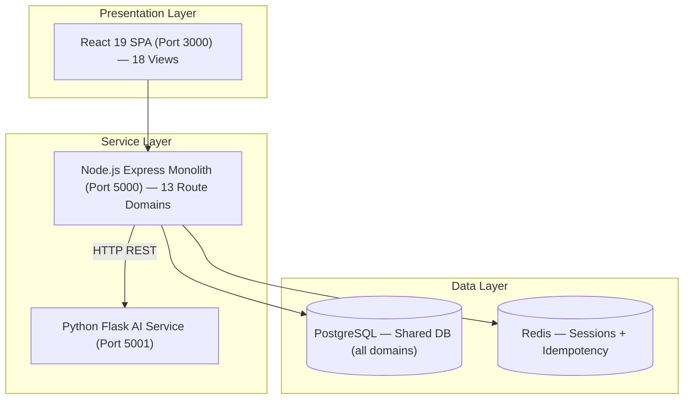
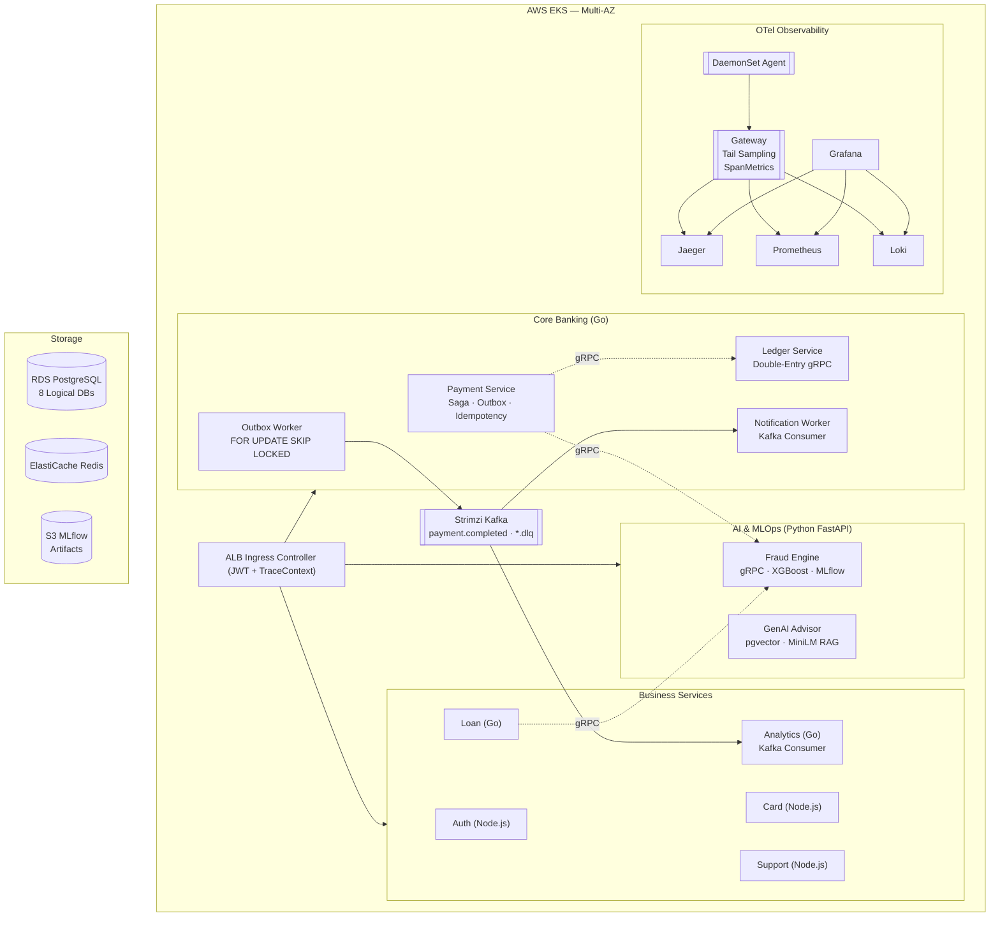

# 🏦 Aura Bank — Cloud-Native DevOps + AI Banking Platform

<div align="center">

[](https://github.com/yourusername/aurabank/actions)
[](https://go.dev/)
[](https://www.python.org/)
[](https://www.typescriptlang.org/)
[](https://react.dev/)
[](https://kubernetes.io/)
[](https://www.terraform.io/)
[](https://argoproj.github.io/)
[](https://opentelemetry.io/)
[](https://mlflow.org/)

**Production-Grade Monolith → Microservices Transformation: Event-Driven Banking with Double-Entry Accounting, gRPC AI Risk Scoring, Full OTel Observability, and AWS EKS GitOps Deployment**

[Architecture](#-system-architecture) • [Microservices](#-microservice-registry) • [DevOps Pipeline](#-devops--cicd) • [Observability](#-observability-stack) • [AI & MLOps](#-ai--mlops) • [Quick Start](#-quick-start) • [Migration Plan](#-migration-roadmap)

</div>

---

## 📖 Project Overview

**AuraBank** demonstrates a production-grade migration of a **monolithic Node.js banking application** (18 UI views, 13 REST route domains, single PostgreSQL) into a **cloud-native microservices platform** on AWS EKS.

This is a **DevOps + MLOps portfolio project** built to production standards, covering the complete engineering lifecycle:

| Discipline | What's Demonstrated |
| :--- | :--- |
| **Cloud Infrastructure** | Terraform modular IaC for AWS (EKS, RDS Multi-AZ, ElastiCache, ECR, S3, Secrets Manager) |
| **GitOps** | ArgoCD auto-sync with self-healing; External Secrets Operator (no secrets in Git) |
| **CI/CD** | GitHub Actions matrix pipeline: lint/test/scan for Go + Node.js + Python; buf generate; helm lint |
| **Distributed Systems** | Transactional Outbox Pattern, Saga state machine, gRPC contracts (Protobuf v3), Kafka DLQ |
| **Financial Engineering** | Double-entry ledger (DEBIT + CREDIT = 0), authoritative idempotency, immutable ledger entries |
| **SRE & Observability** | OTel DaemonSet+Gateway, Tail Sampling, SpanMetrics, Jaeger, Loki, Prometheus SLO dashboards |
| **Kubernetes Hardening** | NetworkPolicy default-deny, PDB, TopologySpreadConstraints (3 AZs), HPA, Karpenter |
| **Chaos Engineering** | LitmusChaos experiments with measured MTTR (pod crash, latency injection, broker failure) |
| **AI / MLOps** | FastAPI + gRPC fraud engine (XGBoost), MLflow model registry, circuit breaker fallback, drift monitoring |
| **GenAI / RAG** | pgvector RAG financial advisor (MiniLM-L6-v2 embeddings, IVFFlat index) |

---

## 🏗️ System Architecture

### Current State: Monolith (Starting Point)



**Problems**: No domain isolation, shared DB, Flask AI outage blocks payments, can't scale independently.

### Target State: Microservices on AWS EKS



---

## 📋 Microservice Registry

| Service | Language | Database | Port | Description |
| :--- | :--- | :--- | :--- | :--- |
| **Auth Service** | Node.js / TS | `user_db` | 8080 | JWT, Argon2id, KYC, profiles, system config |
| **Payment Service** | Go | `payments_db` | 8080 | Saga state machine, idempotency, ATM tokens, outbox writer |
| **Ledger Service** | Go | `ledger_db` | 8080 (REST) + 9090 (gRPC) | Double-entry accounting, immutable entries, gRPC interface |
| **Outbox Worker** | Go | `payments_db` (polling) | — | `FOR UPDATE SKIP LOCKED` → Kafka publisher, DLQ routing |
| **Notification Worker** | Go | — | — | Kafka consumer → Email/SMS/Push dispatch |
| **Card Service** | Node.js / TS | `cards_db` | 8080 | Card lifecycle, admin approvals |
| **Loan Service** | Go | `loans_db` | 8080 | EMI schedule, repayment, AI risk via gRPC |
| **Support Service** | Node.js / TS | `support_db` | 8080 | Tickets, feedback, FAQs, staff chat |
| **Analytics Service** | Go | `analytics_db` | 8080 | Kafka consumer → spending aggregations |
| **AI Fraud Engine** | Python / FastAPI | MLflow (S3) | 8080 (REST/health) + 9091 (gRPC) | XGBoost inference, fallback rules, drift metrics |
| **GenAI Advisor** | Python / FastAPI | `vector_db` (pgvector) | 8080 | RAG chatbot, MiniLM embeddings, feedback corrections |

---

## 🔧 DevOps & CI/CD

### CI Pipeline (GitHub Actions Matrix)

```
PR / Push to main
    │
    ├── Proto: buf lint + buf generate (Go + Python stubs)
    ├── OpenAPI: spectral lint (all openapi/*.yaml)
    │
    ├── Matrix Test (Go / Node.js / Python × each service)
    │   ├── Go: go test -race -coverprofile
    │   ├── Node: vitest + eslint
    │   └── Python: pytest --cov --cov-fail-under=70
    │
    ├── Security (per service)
    │   ├── Trivy container scan (CRITICAL/HIGH → fail)
    │   └── SonarQube SAST
    │
    ├── helm lint --strict (all charts)
    │
    └── [main branch only] Docker Build + ECR Push
            → Update helm/*/values.yaml (image tag)
            → Commit → ArgoCD detects + deploys
```

### GitOps Flow (ArgoCD)

```
gitops/
├── apps/
│   ├── banking-namespace.yaml      ← ArgoCD Application: deploys all banking services
│   └── observability-namespace.yaml ← ArgoCD Application: deploys OTel + Grafana stack
└── external-secrets/               ← ESO ExternalSecret manifests (no secret values)
```

ArgoCD polls every 30 seconds. Any drift from the Git-declared state is self-healed automatically.

### Secrets Management (Zero Secrets in Git)

```
AWS Secrets Manager
    └── aurabank/prod/payment-service
        ├── db_password
        └── redis_password
            ↓
    External Secrets Operator (ClusterSecretStore)
            ↓
    Kubernetes Secret (runtime only, never in Git)
            ↓
    Payment Service Pod (env vars)
```

---

## 📊 Observability Stack

### OTel Architecture (DaemonSet + Gateway)

```
Each Pod
  └── OTLP (gRPC/HTTP) ──→ OTel Agent (DaemonSet, one per node)
                                └── OTLP batch ──→ OTel Gateway (Deployment + HPA)
                                                        ├── Tail Sampling
                                                        │   ├── 100%: service.criticality=financial
                                                        │   ├── 100%: ERROR status spans
                                                        │   └── 1%: background/analytics spans
                                                        ├── SpanMetrics → Prometheus
                                                        ├── Traces → Jaeger
                                                        └── Logs → Loki
```

### Service Access (Local Dev)

| Service | URL | Notes |
| :--- | :--- | :--- |
| Banking Web SPA | http://localhost:3000 | React 19 frontend |
| Jaeger UI | http://localhost:16686 | Distributed trace explorer |
| Grafana | http://localhost:3001 | User: `admin` / Pass: `admin` |
| Prometheus | http://localhost:9090 | PromQL query browser |
| MLflow | http://localhost:5002 | Model registry |
| LocalStack | http://localhost:4566 | AWS service simulator |

### Grafana Dashboards

1. **SLO & Error Budget** — Payment availability %, error budget remaining, burn rate
2. **Payment Overview** — Transaction rate, p50/p95/p99 latency, fraud flag rate
3. **Fraud Engine** — p95 gRPC latency, fallback rate, model drift indicators
4. **Kafka Lag** — Consumer group lag per topic, DLQ message count
5. **Infrastructure** — Node CPU/memory, pod restarts, HPA scaling events

---

## 🤖 AI & MLOps

### Fraud Detection Engine

- **Model**: XGBoost ensemble (migrated from Flask → FastAPI + gRPC)
- **Interface**: gRPC (`proto/fraud.proto`) — Payment Service and Loan Service call this
- **Latency Target**: p95 < 10ms (measured under k6 load)
- **Fallback**: If model throws or gRPC timeout > 15ms → rule-based evaluation (amount thresholds)
- **Registry**: MLflow with S3 artifact backend; model loaded at startup, version tracked
- **Drift**: Input feature distributions exported as Prometheus histograms; alert fires on shift

### GenAI Financial Advisor (RAG)

- **Embeddings**: `sentence-transformers/all-MiniLM-L6-v2` (384-dim, CPU-only, Apache 2.0)
- **Vector Store**: pgvector with IVFFlat index (`lists=100`) in `vector_db`
- **Feedback Loop**: User corrections stored in `feedback_corrections` PostgreSQL table (replaces file-based `user_corrections.json` — multi-pod safe, queryable, persistent)
- **Authorization**: RAG context filtered by `user_id` — no cross-user knowledge leakage

### MLOps Pipeline

```
Synthetic Training Data
    → XGBoost training + cross-validation
    → MLflow experiment tracking (metrics, params, artifacts → S3)
    → MLflow model registration (Staging → Production)
    → Docker image build (model baked in)
    → ECR push → ArgoCD deploys new Fraud Service version
    → Prometheus drift alert if input distribution shifts
```

---

## 🔒 Security Architecture

| Layer | Control |
| :--- | :--- |
| **Secrets** | AWS Secrets Manager + ESO — zero secrets in Git or K8s YAML |
| **Auth** | JWT (RS256) access + refresh tokens; Argon2id password hashing |
| **Network** | NetworkPolicy default-deny-all; explicit egress allowlist per service |
| **Container** | `runAsNonRoot`, `readOnlyRootFilesystem`, `allowPrivilegeEscalation: false`, `drop: ALL` |
| **CI Scanning** | Trivy (CRITICAL/HIGH blocks merge) + SonarQube SAST |
| **IAM** | IRSA (per-service Kubernetes ServiceAccount → AWS IAM role) |
| **Ingress TLS** | TLS terminated at ALB; internal cluster communication on HTTP (mTLS via Istio — future) |

---

## 🌪️ Chaos Engineering Results

| Experiment | Tool | Failure Injected | Result | MTTR |
| :--- | :--- | :--- | :--- | :--- |
| Pod Crash | LitmusChaos | Terminate Payment Service pod | PDB ensured min 2 replicas; K8s rescheduled | < 20s |
| Latency Injection | LitmusChaos | 500ms delay on Ledger Service | gRPC timeout → circuit breaker → payment returns 503 | < 5s |
| Broker Failure | LitmusChaos | Kill Kafka broker | Outbox events stayed PENDING; resumed on broker recovery | < 30s |
| AZ Node Drain | Manual | Drain all nodes in us-east-1a | TopologySpreadConstraints → load shifted to b/c; Karpenter provisioned new nodes | < 90s |

> See `chaos/results/` for Grafana screenshots and detailed timelines.

---

## ⚡ Quick Start (Local Dev — Docker Compose)

```bash
# 1. Clone repository
git clone https://github.com/yourusername/aurabank.git
cd aurabank

# 2. Launch full local stack (Kafka, PostgreSQL, Redis, OTel, Jaeger, Grafana, MLflow)
docker compose -f docker-compose.local.yaml up -d

# 3. Initialize databases and seed system accounts
./scripts/init-dbs.sh

# 4. Start all services in development mode
./scripts/start-dev.sh

# 5. Run integration tests
./scripts/run-integration-tests.sh
```

## 🚀 AWS EKS Deployment (GitOps)

```bash
# 1. Provision AWS infrastructure
cd terraform/environments/prod
terraform init
terraform plan
terraform apply

# 2. Configure kubeconfig
aws eks update-kubeconfig --name aurabank-prod --region us-east-1

# 3. Install ArgoCD + bootstrap GitOps
kubectl apply -f gitops/bootstrap/

# 4. ArgoCD will auto-sync all services from gitops/apps/
# Monitor sync status:
argocd app list
```

---

## 🗺️ Migration Roadmap

| Phase | Timeline | Deliverables |
| :--- | :--- | :--- |
| **0: Local Foundation** | Week 1 | Docker Compose full stack, monolith tests passing, k6 baseline |
| **1: Cloud Platform** | Weeks 2–5 | Terraform IaC, GitHub Actions CI, ArgoCD GitOps, ESO secrets |
| **2: Core Banking** | Weeks 6–13 | Auth, Payment (Outbox + Saga), Ledger (gRPC), Notification Worker |
| **3: Business Services** | Weeks 14–17 | Card, Loan, Support, Analytics (Kafka consumer) |
| **4: Observability + Hardening** | Weeks 18–24 | OTel Agent+Gateway, SLO dashboards, NetworkPolicies, LitmusChaos |
| **5: AI & MLOps** | Weeks 25–32 | FastAPI+gRPC fraud engine, MLflow, GenAI RAG advisor |

**Full details**: See [implementation_plan.md](implementation_plan.md) and [monolith_to_microservices.md](monolith_to_microservices.md).

---

## 📚 Documentation Index

| Document | Purpose |
| :--- | :--- |
| [implementation_plan.md](implementation_plan.md) | Engineering blueprint: patterns, K8s specs, CI/CD config, OTel config |
| [monolith_to_microservices.md](monolith_to_microservices.md) | Migration guide: domain mapping, schemas, gRPC protos, code templates |
| [monolith_to_microservices_architecture_report.md](monolith_to_microservices_architecture_report.md) | Architecture report: diagrams, decisions, SLO recording rules, Terraform structure |
| [devops_ai_resume_showcase_guide.md](devops_ai_resume_showcase_guide.md) | Resume bullets, interview scenarios, portfolio guidance, honest scope notes |

---

<div align="center">

Developed by **[@yourusername](https://github.com/yourusername)**

*DevOps + AI/MLOps Portfolio Project — Production-Grade Design on a Student Budget*

</div>
