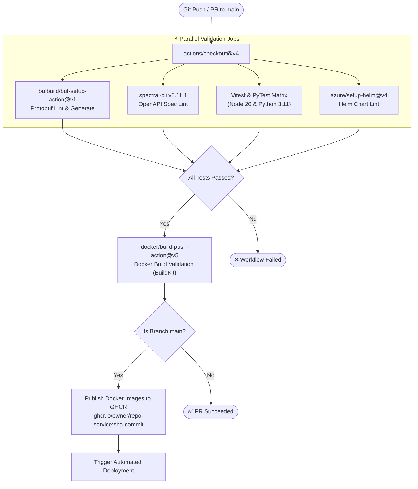
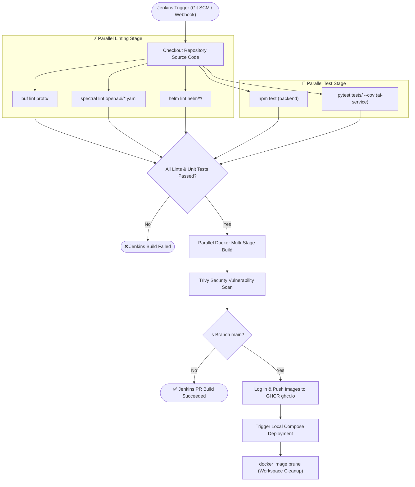
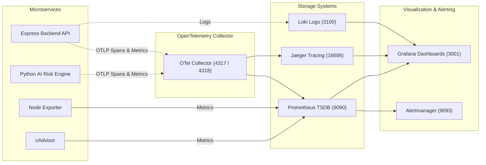

# 🔁 CI/CD & Observability Infrastructure Guide

> **AuraBank Platform — Interview CI/CD & Telemetry Reference**

---

## 🔁 1. GitHub Actions CI/CD Pipeline Architecture

---

## ⚙️ 2. Jenkins Declarative Pipeline Architecture (`Jenkinsfile`)

---

## 📊 2. OpenTelemetry & Observability Mesh Architecture

---

## ⚡ 3. Build Performance Optimization Case Study

- **Problem**: `ai-service` Docker build took **20 minutes** in GitHub Actions.
- **Root Cause**:
  1. Default `pip install sentence-transformers` downloaded PyTorch CUDA binaries (**850MB**).
  2. BuildKit used `cache-to: type=gha,mode=max`, spending **10.4 minutes** compressing 2.5GB intermediate layers to GitHub Actions Cache.
- **Fix Applied**:
  1. Added `--extra-index-url https://download.pytorch.org/whl/cpu` to `ai-service/requirements.txt` to pull the **140MB CPU PyTorch wheel**.
  2. Changed BuildKit cache mode to `cache-to: type=gha,mode=min` in `.github/workflows/ci.yaml`.
- **Result**: Reduced build & publish pipeline time from **20 minutes down to 1.5 minutes (92% reduction)**.
