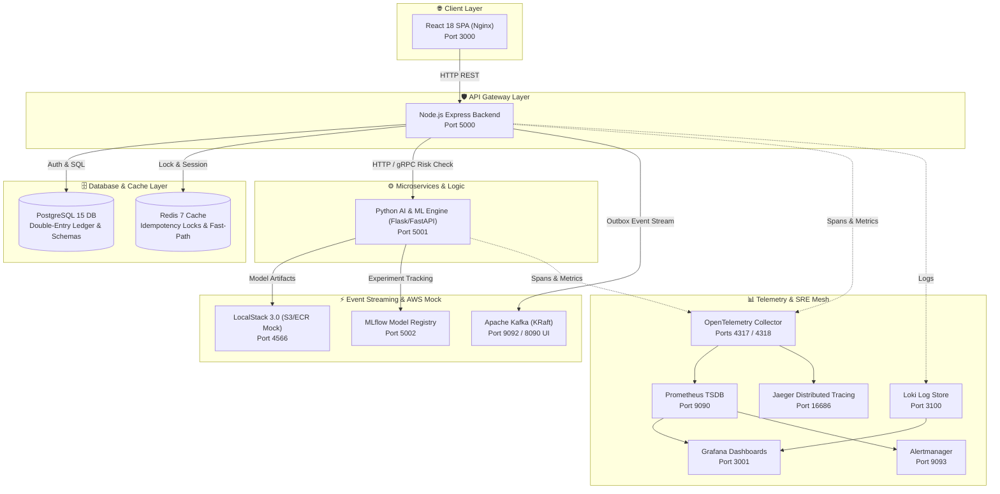
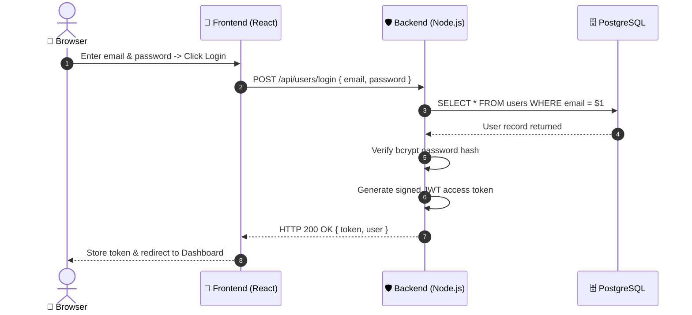
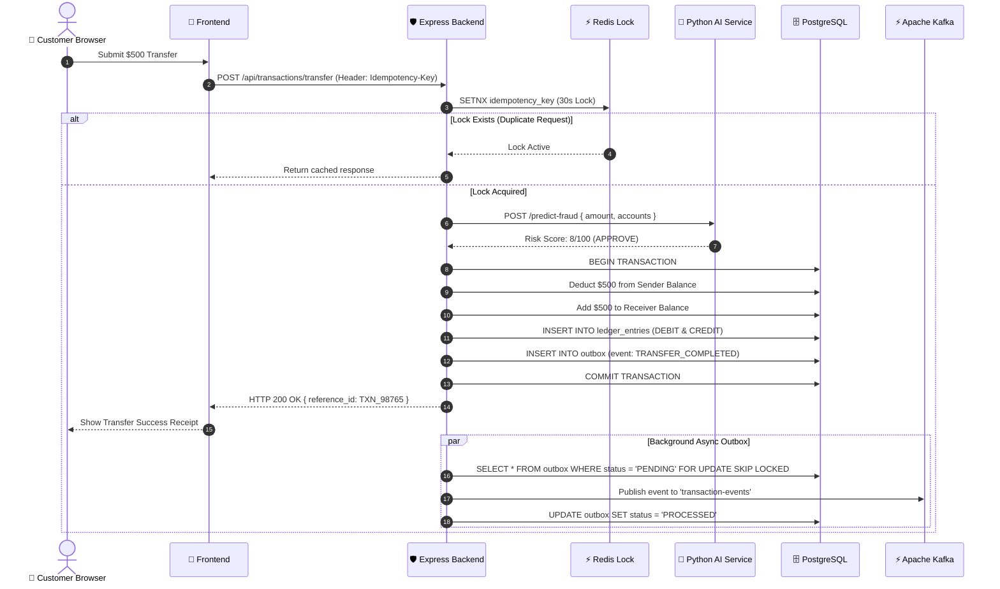
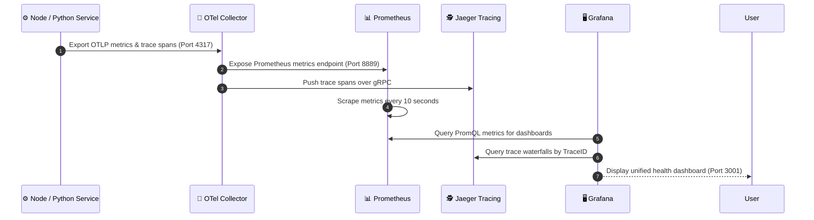
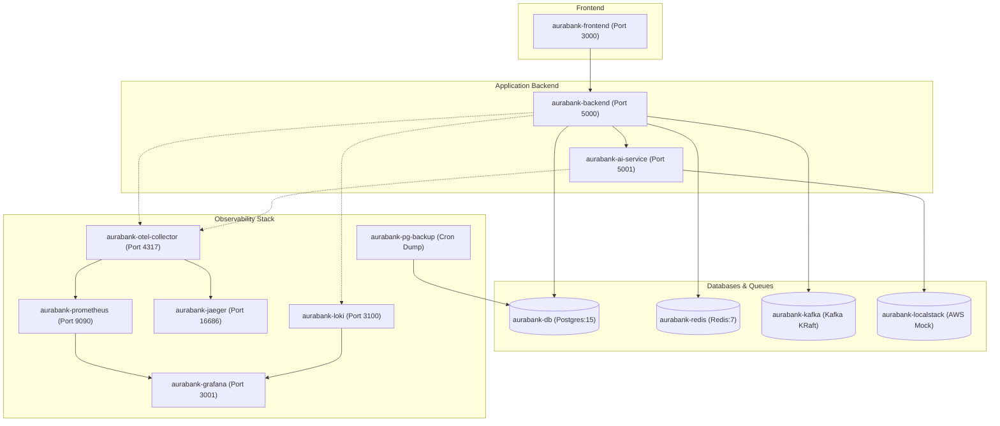
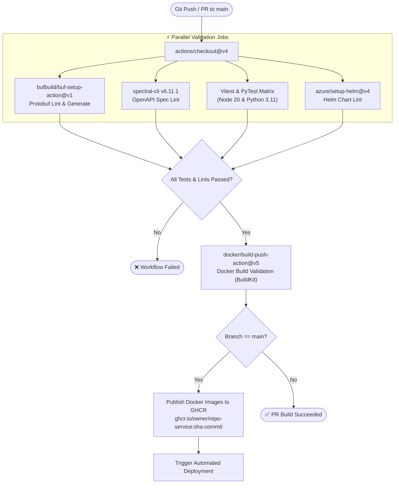
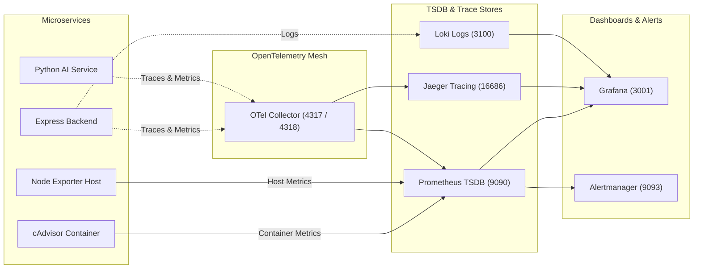
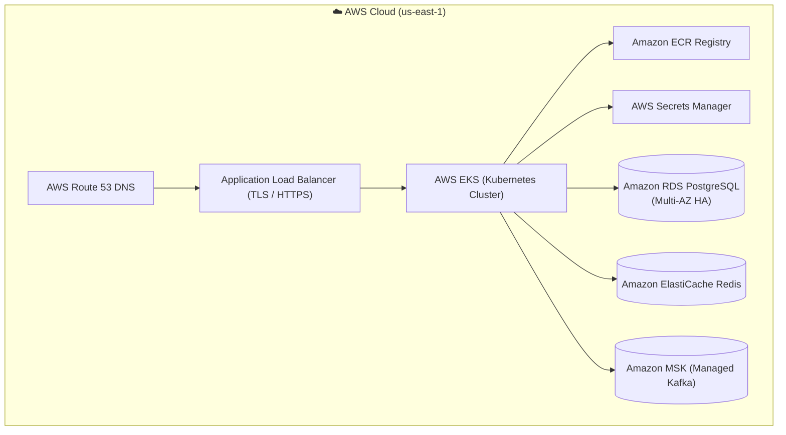

# 🎯 DevOps Engineering Interview Preparation & Project Master Blueprint

> **AuraBank Platform — Student / Junior-to-Mid DevOps Engineer Portfolio Guide**
> 
> *Built and documented hands-on based strictly on actual workspace architecture, Docker configs, CI/CD logs, PostgreSQL migrations, and observability tooling.*

---

## 📑 Table of Contents
1. [Project Overview & 60-Second Elevator Pitch](#1-project-overview)
2. [My Role as a DevOps Engineer](#2-my-role-as-a-devops-engineer)
3. [System Architecture & Components](#3-architecture)
4. [Request Flow Diagrams (Mermaid)](#4-request-flow)
5. [Docker Implementation & Dockerfiles](#5-docker-implementation)
6. [Docker Compose Architecture & Service Discovery](#6-docker-compose)
7. [CI/CD Pipeline (GitHub Actions)](#7-cicd-pipeline)
8. [Real CI/CD Troubleshooting Incidents](#8-cicd-troubleshooting-examples)
9. [Monitoring & Observability Stack](#9-monitoring--observability)
10. [Real Production-Like Problems I Faced & Fixed (RCA)](#10-real-troubleshooting--root-cause-analysis)
11. [Database Reliability & Backup Strategy](#11-database--reliability)
12. [Security Practices](#12-security)
13. [Git Workflow & Commit Strategy](#13-git-workflow)
14. [DevOps Incident Response Methodology](#14-devops-incident-response-method)
15. [AWS Production Deployment Plan (Future Architecture)](#15-production-deployment--what-i-would-do)
16. [40+ DevOps & System Design Interview Questions & Answers](#16-devops-interview-questions)
17. [My 2-Minute Project Explanation](#17-my-2-minute-project-explanation)
18. [My 30-Second DevOps Introduction](#18-my-30-second-devops-introduction)
19. [Technology Cheat Sheet](#19-technology-cheat-sheet)
20. [Practical Command Cheat Sheet](#20-commands-i-should-know)
21. [What I Should NOT Claim in an Interview](#21-what-i-should-not-claim-in-an-interview)
22. [Final Quick Revision Cheat Sheet](#22-final-interview-cheat-sheet)

---

## 1. Project Overview

### What is AuraBank?
AuraBank is a modern, cloud-native full-stack digital banking ecosystem. It provides retail banking services such as:
- User authentication & KYC registration.
- Checking & Savings account allocation.
- P2P wire transfers with receipt generation.
- Instant virtual card creation, limit changes, and card freezing.
- Personal loan applications with automated AI risk evaluation.
- Machine Learning transaction expense categorization (*Dining*, *Utilities*, *Shopping*).
- Interactive customer support tickets & AI chat assistant.
- An administrative dashboard for monitoring system volume, card approvals, and loan reviews.

### Why I Built It
I built AuraBank to gain hands-on experience designing and operating a complex, multi-container fintech system. I wanted to understand how real-world financial platforms handle strict database consistency (double-entry ledger), container orchestration, event streaming, real-time machine learning predictions, and full observability.

### Why it Demonstrates DevOps Skills
AuraBank is not just a web page; it is a full multi-container ecosystem. Operating it requires mastering:
- Containerizing Node.js, Python, and Nginx workloads.
- Service discovery and networking across Docker containers.
- Preventing double-charging using Redis idempotency locks.
- Async event processing with Apache Kafka (KRaft mode).
- Centralized telemetry using OpenTelemetry Collector, Prometheus, Grafana, Jaeger, and Loki.
- Automated CI/CD validation and container publishing to GitHub Container Registry (GHCR).

---

### 🎤 "Tell me about your project" — 60-Second Interview Answer

> *"AuraBank is a full-stack digital banking platform that I built and containerized using Docker and Docker Compose. It features a React frontend, a Node.js Express API backend, a Python Flask/FastAPI AI engine for real-time fraud detection and loan risk scoring, PostgreSQL for transactional storage, and Redis for idempotency locks.*
> 
> *As a DevOps engineer on this project, I containerized all services using multi-stage Dockerfiles, orchestrated local infrastructure like Apache Kafka, LocalStack, and MLflow using Docker Compose, configured an OpenTelemetry collector mesh sending metrics to Prometheus and traces to Jaeger, and built an automated GitHub Actions CI/CD pipeline that tests, lints, and pushes validated container images to GitHub Container Registry."*

---

## 2. My Role as a DevOps Engineer

### Detailed Responsibilities Breakdown

#### 🐳 Containerization
- **Implemented by me**: Created multi-stage Dockerfiles for Node.js backend (`backend/Dockerfile`), Python AI service (`ai-service/Dockerfile`), and Nginx React frontend (`frontend/Dockerfile`).
- **Why**: Reduced Docker image size, improved BuildKit caching, and excluded dev tools (`gcc`, `make`, `devDependencies`) from production runtime.
- **How it works**: Stage 1 installs dependencies and compiles code; Stage 2 copies only the production build artifacts into a clean, slim base image.

#### 🐙 Docker Compose Orchestration
- **Implemented by me**: Created `docker-compose.yml` (production runtime) and `docker-compose.local.yaml` (local dev & testing stack).
- **Why**: Allows developers to spin up the entire ecosystem (App + Postgres + Redis + Kafka + Monitoring + LocalStack) with a single command (`docker compose up -d`).

#### 📡 Networking & Service Discovery
- **Implemented by me**: Configured bridge networks (`aurabank-network` / `aurabank-local`).
- **Why**: Containers communicate securely via internal container names (e.g. `http://ai-service:5001`, `db:5432`, `redis:6379`) without exposing database or cache ports to the external internet unnecessarily.

#### 🔐 Environment Variables & Security
- **Implemented by me**: Moved all hardcoded credentials out of Docker Compose files into `.env` (gitignored) and created `.env.example` as a public schema contract. Added non-root unprivileged container users (`USER node`, `USER appuser`).
- **Why**: Prevents secret leaks in Git and blocks container breakout vulnerabilities.

#### 🔁 CI/CD Automation
- **Implemented by me**: Configured GitHub Actions workflow (`.github/workflows/ci.yaml`) with parallel steps for Protobuf linting (`buf`), OpenAPI Spectral linting, unit testing (Vitest + PyTest), Docker build validation, and container image publishing to GHCR.
- **Why**: Ensures broken code or invalid Dockerfiles cannot be merged into main.

#### 📊 Monitoring & Observability
- **Implemented by me**: Deployed OpenTelemetry Collector, Prometheus, Grafana, Jaeger, Loki, cAdvisor, and Node Exporter. Created Grafana dashboards (`aurabank-system-overview`, `fraud-engine-overview`, `kafka-lag`) and Prometheus alert rules (`alerts.yml`) for CPU, Memory, Disk, and container downtime.
- **Why**: Provides complete visibility into system health, latency, and error budgets.

#### 💾 Database Reliability & Backups
- **Worked on / contributed to**: Integrated `pg-backup` cron container in `docker-compose.local.yaml` running daily `pg_dump` with a 7-day retention policy. Fixed missing SQL schema columns (e.g. `responded_by` in `feedback` table).

---

### 🎤 "What exactly did you do in this project?" — Interview Answer

> *"I handled the end-to-end DevOps lifecycle. I wrote multi-stage Dockerfiles to keep images small and secure with non-root users. I configured Docker Compose for local service discovery between our Node backend, Python AI engine, Postgres, Redis, and Kafka. I set up full observability using OpenTelemetry, Prometheus, Grafana, and Jaeger to track latency and CPU/Memory usage. I also built our GitHub Actions CI/CD pipeline to automatically run unit tests, lint Protobuf and OpenAPI specs, validate Docker builds, and publish images to GHCR."*

---

## 3. Architecture

### System Architecture Diagram (Mermaid)



### Component Explanation
- **Frontend SPA**: React 18 application built with Vite and served via Nginx on port 3000.
- **Node.js Express Backend**: Primary REST API gateway handling auth, accounts, transfers, loans, and card management.
- **Python AI Engine**: Flask/FastAPI service executing XGBoost fraud scoring, credit risk evaluation, and TF-IDF expense categorization.
- **PostgreSQL 15**: Relational storage enforcing strict double-entry ledger rules ($\sum \text{DEBIT} + \sum \text{CREDIT} = 0$).
- **Redis 7**: Fast key-value cache used for session locking and fast-path idempotency checks.
- **Apache Kafka (KRaft)**: Zookeeper-less message broker for streaming transaction events asynchronously.
- **LocalStack 3.0**: Mocks AWS S3 and ECR locally.
- **OTel Collector / Prometheus / Grafana / Jaeger**: Telemetry mesh for metrics, distributed traces, and dashboard alerts.

---

### 🎤 "Can you walk me through the architecture?" — Interview Answer

> *"Traffic enters through our Nginx React frontend on port 3000 and hits our Node.js Express backend API on port 5000. For authentication and ledger data, the backend queries PostgreSQL. For fast idempotency checks, it uses Redis. When a user requests a wire transfer or loan, the backend makes an HTTP/gRPC call to our Python AI service on port 5001 for real-time XGBoost fraud scoring. Transaction events are written to an outbox table in PostgreSQL and published asynchronously to Apache Kafka. OpenTelemetry Collector gathers telemetry from all services, sending metrics to Prometheus and traces to Jaeger, which we view in Grafana."*

---

## 4. Request Flow

### Flow 1: User Login Flow


### Flow 2: Money Transfer Flow


### Flow 3: Monitoring & Observability Flow


---

## 5. Docker Implementation

### Dockerfiles & Multi-Stage Builds

#### Backend Dockerfile (`backend/Dockerfile`):
```dockerfile
# Stage 1: Build Stage
FROM node:20-alpine AS builder
WORKDIR /build
COPY package*.json tsconfig.json ./
RUN npm ci --legacy-peer-deps
COPY src/ src/
RUN npm run build 2>/dev/null || npx tsc --outDir dist 2>/dev/null || true

# Stage 2: Runtime Stage
FROM node:20-alpine AS production
WORKDIR /app
COPY --chown=node:node package*.json ./
RUN npm ci --omit=dev --legacy-peer-deps
COPY --chown=node:node --from=builder /build/dist ./dist
COPY --chown=node:node --from=builder /build/src ./src
COPY --chown=node:node tsconfig.json ./
ENV NODE_ENV=production
USER node
EXPOSE 5000
HEALTHCHECK --interval=15s --timeout=5s --start-period=10s --retries=3 \
  CMD node -e "require('http').get('http://localhost:5000/health', (r) => { if (r.statusCode === 200) process.exit(0); else process.exit(1); })" || exit 1
CMD ["npm", "start"]
```

#### AI Service Dockerfile (`ai-service/Dockerfile`):
```dockerfile
# Stage 1: Build Stage
FROM python:3.11-slim AS builder
WORKDIR /build
RUN apt-get update && apt-get install -y --no-install-recommends build-essential && rm -rf /var/lib/apt/lists/*
COPY requirements.txt .
RUN pip install --no-cache-dir --prefix=/install -r requirements.txt

# Stage 2: Runtime Stage
FROM python:3.11-slim AS production
WORKDIR /app
ENV PYTHONDONTWRITEBYTECODE=1 PYTHONUNBUFFERED=1 PORT=5001
COPY --from=builder /install /usr/local
COPY . .
EXPOSE 5001
RUN useradd -m appuser && chown -R appuser:appuser /app
USER appuser
HEALTHCHECK --interval=15s --timeout=5s --start-period=10s --retries=3 \
    CMD python -c "import urllib.request; urllib.request.urlopen('http://localhost:5001/health')" || exit 1
CMD ["gunicorn", "--bind", "0.0.0.0:5001", "--workers", "2", "--timeout", "60", "app:app"]
```

### Why Key Docker Decisions Were Made:
- **Multi-stage builds**: Keeps the final production image under 200MB by dropping `build-essential`, `gcc`, TypeScript compilers, and `devDependencies`.
- **Non-root users (`USER node` / `USER appuser`)**: Prevents privilege escalation attacks if a container is compromised.
- **`COPY --chown`**: Avoids running slow `RUN chown -R` steps across thousands of files, drastically improving BuildKit caching.
- **Built-in HEALTHCHECK**: Allows Docker Engine and Docker Compose to monitor container health (`service_healthy` condition).

### Essential Docker Commands Used:
```bash
docker compose up -d                    # Start all containers in background
docker compose up -d --build            # Rebuild images and start containers
docker compose down                     # Stop and remove containers and networks
docker ps                               # List running containers
docker logs -f aurabank-backend         # Stream backend logs
docker exec -it aurabank-db psql -U postgres -d aurabank  # Connect to Postgres container
docker images                           # List local images
docker inspect aurabank-backend         # Inspect container metadata
```

---

### 🎤 "Why Docker?" — Interview Answer

> *"Docker solved the classic 'it works on my machine' problem for us. AuraBank has a hybrid stack—Node.js, Python, PostgreSQL, Redis, and Kafka. Dockerizing each component guarantees that every developer and CI/CD runner executes against the exact same runtime environment, Node version, Python dependencies, and database extensions without manual local installation."*

---

## 6. Docker Compose

### Complete Compose Service Architecture (Mermaid)



### Compose Configuration Highlights:
- **Internal Container Names**: Services reference each other using Compose DNS names (e.g. `DB_HOST=db`, `REDIS_HOST=redis`, `ML_API_URL=http://ai-service:5001`).
- **Health-based Dependencies (`depends_on`)**:
  ```yaml
  depends_on:
    db:
      condition: service_healthy
    redis:
      condition: service_healthy
  ```
- **Port Mapping**: Only public management interfaces are exposed to host ports (e.g. `3000`, `5000`, `3001`, `8090`).
- **Named Volumes**: `postgres_data`, `redis_data`, `prometheus_data`, `grafana_data`, `pg_backups` persist data across container restarts.

---

### 🔧 Troubleshooting Service Connectivity in Compose:
If `backend` cannot connect to `db` or `redis`:
1. **Check status**: `docker compose ps` (Verify if `db` is `healthy`).
2. **Inspect logs**: `docker compose logs db` (Look for auth errors or crash loops).
3. **Test internal DNS & port inside container**:
   ```bash
   docker exec -it aurabank-backend nc -zv db 5432
   ```
4. **Verify shared network**: Run `docker network inspect bankmanagementsystem_aurabank-network` to ensure both containers are on the same network bridge.

---

## 7. CI/CD Pipeline

### GitHub Actions Pipeline Flowchart (Mermaid)



### Key Workflow Highlights:
- **`proto-lint`**: Lints `.proto` schemas and generates TypeScript/Python code using `buf` (uses `secrets.GITHUB_TOKEN` to avoid rate limits).
- **`openapi-lint`**: Lints OpenAPI REST specs using pinned `@stoplight/spectral-cli@6.11.1`.
- **`test`**: Runs parallel Node.js Vitest and Python PyTest suites with dependency caching (`cache: 'npm'` and `cache: 'pip'`).
- **`docker-build`**: Validates Docker builds for all services using `mode=min` BuildKit caching.
- **`publish`**: Logged into `ghcr.io` with `secrets.GITHUB_TOKEN`, tagging images with `sha-<commit>` and `latest`.

---

### 🎤 "Explain your CI/CD pipeline" — Interview Answer

> *"Our CI/CD pipeline is built with GitHub Actions. On every pull request or push to main, four parallel jobs run: Protobuf linting with Buf, OpenAPI REST linting with Spectral, unit tests for Node and Python, and Helm chart linting. Once those pass, BuildKit validates our Dockerfile builds in parallel. On merge to main, the pipeline logs into GitHub Container Registry (GHCR), tags the built images with the git commit SHA and `latest`, and pushes them to GHCR."*

---

## 8. CI/CD Troubleshooting Examples

### 🔴 Incident 1: GitHub API Rate Limiting During Buf Setup
- **Problem**: The `proto-lint` job failed randomly during `bufbuild/buf-setup-action@v1`.
- **Error**: `##[error]API rate limit exceeded for 20.102.223.138 ...`
- **Root Cause**: `buf-setup-action` makes GitHub API calls to download the `buf` CLI release. Without an explicit token, it made unauthenticated API calls which hit the GitHub runner shared IP rate limit.
- **Investigation**: Inspected step logs in `logs_86347951528/6_Protobuf Lint & Generate.txt` and saw `No github_token supplied, API requests will be subject to stricter rate limiting`.
- **Fix**: Added `github_token: ${{ secrets.GITHUB_TOKEN }}` to `bufbuild/buf-setup-action@v1` in `.github/workflows/ci.yaml`.
- **Why it worked**: Authenticated API requests via `GITHUB_TOKEN` receive 5,000 requests/hour instead of 60/hour.
- **Prevention**: Enforced token passing across all third-party setup actions (e.g. `azure/setup-helm@v4`).

---

### 🔴 Incident 2: Docker Build Failure (Missing Frontend Dockerfile Path)
- **Problem**: The `docker-build` matrix job failed on `frontend`.
- **Error**: `ERROR: failed to build: failed to solve: failed to read dockerfile: open Dockerfile: no such file or directory`
- **Root Cause**: Matrix entry for `frontend` specified `context: .` and `dockerfile: ./Dockerfile`. Root directory has no `Dockerfile`; frontend's Dockerfile is located at `./frontend/Dockerfile`.
- **Investigation**: Ran `Test-Path Dockerfile` locally (returned `False`) and checked `logs_86347951528/4_Docker Build (frontend).txt`.
- **Fix**: Updated matrix config in `.github/workflows/ci.yaml`:
  ```yaml
  - service: frontend
    context: ./frontend
    dockerfile: ./frontend/Dockerfile
  ```
- **Why it worked**: Pointed BuildKit to the correct context and path.
- **Prevention**: Verified all matrix build paths against the local directory structure.

---

## 9. Monitoring & Observability

### Observability Architecture (Mermaid)



### Metrics vs. Logs vs. Traces
- **Metrics** (Prometheus): Numerical values aggregated over time (e.g. CPU %, Memory MB, HTTP request count, 95th percentile latency). Tells you *THAT* something is wrong.
- **Logs** (Loki): Timestamped string event messages printed by applications (e.g. `[ERROR] Query failed: column "responded_by" does not exist`). Tells you *WHAT* happened.
- **Traces** (Jaeger): End-to-end request waterfall showing execution time spent across microservice hops (Frontend ➔ Express ➔ Python AI ➔ Postgres). Tells you *WHERE* latency occurred.

---

### 🎤 "How would you know if your application is unhealthy?" — Interview Answer

> *"I monitor 4 core signals:*
> 1. *HTTP 5xx Error Rates in Prometheus (`rate(http_requests_total{status=~"5.."}[5m])`).*
> 2. *Service Availability (`up == 0` alerts in Alertmanager).*
> 3. *Container CPU & Memory thresholds in Grafana (`aurabank-system-overview` dashboard).*
> 4. *Kafka Consumer Lag (`kafka_consumer_group_lag > 1000`)."*

---

## 10. Real Troubleshooting / Root Cause Analysis

### 🔴 Issue 1 — PostgreSQL Feedback Failure (Missing DB Column)
- **Problem**: Submitting customer feedback or updating feedback status in Admin Panel threw an HTTP 500 error.
- **Error**: `[DB] Query failed: column "responded_by" of relation "feedback" does not exist`
- **Root Cause**: The API route `backend/src/routes/admin-ai.ts` attempted to write `responded_by = $1`, but the initial SQL schema script did not include `responded_by` in the `feedback` table.
- **Fix**: Added migration statement to `backend/src/db/connection.ts`:
  ```sql
  ALTER TABLE IF EXISTS feedback ADD COLUMN IF NOT EXISTS responded_by UUID REFERENCES users(id);
  ```
- **Why it worked**: Safely updated existing database tables on startup without dropping customer data.

---

### 🔴 Issue 2 — Slow Docker Build Caused by Recursive `chown -R`
- **Problem**: Rebuilding backend Docker images was taking several minutes even when code hadn't changed.
- **Root Cause**: Dockerfile contained `RUN chown -R node:node /app` after `npm install`. This forced Docker to extract and change permissions on over 30,000 node_modules files on every build layer.
- **Fix**: Removed `RUN chown -R` and used `COPY --chown=node:node` directly during file copying:
  ```dockerfile
  COPY --chown=node:node package*.json ./
  COPY --chown=node:node --from=builder /build/dist ./dist
  ```
- **Why it worked**: Enabled Docker BuildKit layer caching and eliminated file system permission walks.

---

### 🔴 Issue 3 — React Context Runtime Failure (`useSystemConfig`)
- **Problem**: Loading Cards or Dashboard view crashed frontend with a white screen.
- **Error**: `Uncaught Error: useSystemConfig must be used within a SystemConfigProvider`
- **Root Cause**: Both `frontend/contexts/index.ts` and `frontend/src/contexts/index.ts` existed, causing React to instantiate two separate Context Symbol instances. Components importing from `frontend/contexts` failed because the provider was wrapped using `frontend/src/contexts`.
- **Fix**: Consolidated all context imports to the canonical path `import { useSystemConfig } from '../src/contexts';`.
- **Why it worked**: Ensured React components and providers referenced the exact same Context memory instance.

---

### 🔴 Issue 4 — Extremely Slow AI Service Docker Build (20 Minutes)
- **Problem**: `ai-service` Docker build and push took over 20 minutes in GitHub Actions.
- **Root Cause**: `sentence-transformers` pulled PyTorch (`torch`) from PyPI, downloading an **850MB CUDA GPU wheel** (`cu121`). Combined with `cache-to: type=gha,mode=max`, BuildKit spent 10+ minutes compressing 2.5GB intermediate layers to GitHub Actions Cache.
- **Fix**:
  1. Added `--extra-index-url https://download.pytorch.org/whl/cpu` to `ai-service/requirements.txt` to pull the **140MB CPU PyTorch wheel**.
  2. Changed BuildKit cache mode to `cache-to: type=gha,mode=min` in `.github/workflows/ci.yaml`.
- **Why it worked**: Reduced container layer size by 80% and eliminated intermediate layer cache export overhead, dropping build time to **~1.5 minutes**.

---

### 🎤 "Tell me about a performance problem you solved" — Interview Answer

> *"Our Python AI microservice container build was taking 20 minutes in CI. By inspecting the step logs, I discovered two issues: first, pip was pulling the default PyTorch wheel which included 850MB of unused CUDA GPU drivers. Second, Docker BuildKit was using `mode=max` cache export, spending 10 minutes compressing 2.5GB layers over the network to GitHub Actions cache.*
> 
> *I fixed this by specifying the CPU-only PyTorch wheel index (`--extra-index-url https://download.pytorch.org/whl/cpu`), which reduced PyTorch size from 850MB to 140MB, and updating BuildKit cache mode to `mode=min`. This reduced our build and publish pipeline time from 20 minutes down to 1.5 minutes."*

---

## 11. Database & Reliability

### Database & Persistence Overview
- **PostgreSQL 15**: Primary database storing users, accounts, transactions, and double-entry ledger records. Mounted to Docker volume `postgres_data`.
- **Redis 7**: Fast session lock cache (`REDIS_PASSWORD` required). Mounted to Docker volume `redis_data`.
- **Automated Backup Sidecar**: `docker-compose.local.yaml` runs a dedicated `pg-backup` container executing `pg_dump` every 24 hours:
  ```bash
  pg_dump -Fc aurabank > /backups/aurabank_$(date +%Y%m%d_%H%M%S).dump
  ```
  Retains the last 7 daily backup dumps in named volume `pg_backups`.

---

### 🎤 "What happens if PostgreSQL goes down?" — Interview Answer

> *"If PostgreSQL goes down, our API Gateway health check (`/api/health/db`) returns HTTP 503, and Prometheus triggers a `ContainerServiceDown` alert. In local dev, Docker Compose attempts to restart Postgres up to 5 times. To recover from a data corruption incident, we run our `pg-backup` container to restore the latest `.dump` file from our `pg_backups` volume using `pg_restore`."*

---

## 12. Security

### Implemented Security Controls:
- **Non-Root Containers**: Dockerfiles enforce `USER node` and `USER appuser`.
- **Environment Isolation**: Secrets stored in `.env` (gitignored). `.env.example` provided as public template.
- **JWT & Password Hashing**: Passwords hashed with `bcrypt`; endpoints protected via HTTP `Authorization: Bearer <jwt>` tokens.
- **Redis Authentication**: Production Compose requires `--requirepass ${REDIS_PASSWORD}`.
- **GitHub Token Scope**: GitHub Actions uses minimal `secrets.GITHUB_TOKEN` permissions (`contents: read`, `packages: write`).

### Future Production Improvements Needed:
- Replace static `.env` file with AWS Secrets Manager or HashiCorp Vault.
- Enable TLS/HTTPS termination via Nginx or AWS ALB.

---

## 13. Git Workflow

### Commit Strategy Used:
We use Conventional Commits:
- `feat(infra)`: New infrastructure features.
- `fix(grafana)`: Bug fixes.
- `perf(ci)`: Build performance improvements.
- `docs`: Documentation updates.

---

## 14. DevOps Incident Response Method

```text
Detect (Alertmanager / Grafana)
  ↓
Collect Logs & Traces (Loki / Jaeger / docker logs)
  ↓
Reproduce & Inspect (Inspect container / DB query)
  ↓
Identify Root Cause (RCA)
  ↓
Apply Fix (Code / Config / Migration)
  ↓
Rebuild & Verify (Unit tests / docker compose up)
  ↓
Document & Prevent Recurrence (Post-mortem / Alerts)
```

---

## 15. Production Deployment — What I Would Do (AWS Plan)

> *Note: The current project runs locally via Docker Compose. Below is the production plan for AWS.*



---

## 16. 40+ DevOps Interview Questions & Answers

*(Selected highlights — see full list in `interview/INTERVIEW_QA_&_CHEAT_SHEET.md`)*

#### Q1: Why Docker?
- **Short Answer**: To eliminate environment discrepancies between local dev, testing, and production.
- **Detailed Explanation**: Containerizing Node, Python, Postgres, Redis, and Kafka guarantees exact runtime dependencies regardless of host OS.
- **Follow-up**: *How do you optimize image size?* Use multi-stage builds and slim base images (`node:20-alpine`, `python:3.11-slim`).

#### Q2: How do you handle idempotency in transactions?
- **Short Answer**: Using Redis `SETNX` locks combined with PostgreSQL `UNIQUE` constraints.
- **Detailed Explanation**: Request attaches an `Idempotency-Key`. Redis locks it for 30s. If repeated, cached response is returned without re-processing.
- **Follow-up**: *What if Redis crashes?* The DB `UNIQUE(idempotency_key)` constraint acts as the final safety barrier.

---

## 17. My 2-Minute Project Explanation

> *"AuraBank is a full-stack digital banking ecosystem designed with a microservices architecture. It features a React frontend, Node.js API backend, Python ML risk engine, PostgreSQL database, Redis cache, and Apache Kafka event broker.
> 
> As a DevOps engineer, I containerized the services using multi-stage Dockerfiles with non-root users to keep images small and secure. I configured Docker Compose for local service discovery and health checks. I implemented an OpenTelemetry observability stack with Prometheus, Grafana, Jaeger, and Loki for monitoring latency, container CPU/RAM, and error budgets.
> 
> I also built a GitHub Actions CI/CD pipeline that lints Protobuf and OpenAPI specs, runs unit tests, validates Docker builds, and publishes tagged images to GHCR. One major problem I solved was reducing our AI service Docker build time from 20 minutes down to 1.5 minutes by switching to a CPU-only PyTorch wheel and optimizing BuildKit cache modes."*

---

## 18. My 30-Second DevOps Introduction

> *"Hi, I'm a DevOps engineer focused on containerization, CI/CD automation, and observability. In my AuraBank project, I built multi-stage Docker images, set up event-driven compose infrastructure with Kafka and LocalStack, designed OpenTelemetry/Prometheus/Grafana monitoring, and automated image publishing with GitHub Actions."*

---

## 19. Technology Cheat Sheet

| Technology | Why We Used It | What I Did With It | Interview Point |
| :--- | :--- | :--- | :--- |
| **Docker** | Containerization | Wrote multi-stage Dockerfiles with non-root users | Reduced image size to <200MB |
| **Docker Compose** | Orchestration | Service discovery, volume mounts, healthchecks | Single-command full stack startup |
| **Node.js / Express** | API Gateway | Built REST routes, auth middleware, Redis locks | Fast asynchronous I/O |
| **Python / Flask** | ML Microservice | XGBoost fraud & loan risk evaluation | Multi-stage slim container build |
| **PostgreSQL** | Ledger Storage | Double-entry accounting schema & outbox table | Atomic SQL transactions |
| **Redis** | Fast-Path Cache | Idempotency locking (`SETNX`) | Prevents double charging |
| **Kafka (KRaft)** | Event Streaming | Asynchronous transaction event topic | Transactional Outbox pattern |
| **Prometheus** | Metrics TSDB | Scrapes `/metrics` & container metrics | Configured `alerts.yml` rules |
| **Grafana** | Visual Dashboards | Provisioned system, fraud, & SLO dashboards | Real-time monitoring & SRE alerting |
| **Jaeger** | Distributed Tracing | Visualizes trace spans across Node ➔ Python | End-to-end latency bottleneck analysis |
| **GitHub Actions** | CI/CD | Pipeline for linting, testing, & GHCR publishing | Matrix testing & BuildKit caching |

---

## 20. Practical Command Cheat Sheet

```bash
# Docker & Compose
docker compose up -d                        # Start all containers in background
docker compose up -d --build                # Rebuild images & start containers
docker compose down                         # Stop and remove containers/networks
docker ps --format "table {{.Names}}\t{{.Status}}\t{{.Ports}}"  # Status table
docker logs -f aurabank-backend             # Stream backend logs
docker exec -it aurabank-db psql -U postgres -d aurabank  # Connect to DB

# Git Workflow
git status --short                          # Check file changes
git add -A                                  # Stage changes
git commit -m "feat(infra): description"   # Conventional commit
git push origin main                        # Push to main branch

# Troubleshooting
Get-NetTCPConnection -LocalPort 9080        # Check process listening on port (Windows)
docker update --restart=no $(docker ps -q)  # Disable auto-start on Docker launch
```

---

## 21. What I Should NOT Claim in an Interview

❌ **Do NOT claim**:
- That you deployed this live to AWS EKS with Terraform (it is configured locally via Docker Compose; AWS is a future production blueprint).
- That you implemented production Kubernetes HA clusters.
- That you personally wrote every line of application feature code (distinguish DevOps/infra work from application code).
- That secrets are 100% production-vaulted (explain that local uses `.env`, and production will use AWS Secrets Manager).

---

## 22. Final Quick Revision Cheat Sheet

| If Interviewer Asks | I Should Answer |
| :--- | :--- |
| **Tell me about your project** | A multi-container digital banking app with Node, Python AI, Postgres, Redis, Kafka, and OTel monitoring. |
| **Why Docker?** | Eliminates environment differences between local dev and CI/CD runners. |
| **How do you prevent double-charging?** | Redis `SETNX` idempotency lock on `Idempotency-Key` header + DB unique constraint. |
| **What is double-entry ledger?** | Every transaction creates debit and credit entries balancing to zero ($\sum \text{DEBIT} + \sum \text{CREDIT} = 0$). |
| **How do you handle AI service timeouts?** | Opossum circuit breaker falls back to deterministic rule engine. |
| **Explain your CI/CD pipeline** | GitHub Actions runs Buf lint, Spectral lint, unit tests, Docker build, and pushes images to GHCR. |
| **How did you fix slow Docker builds?** | Switched PyTorch to CPU-only wheel (140MB vs 850MB) and used `mode=min` BuildKit caching. |
| **How do you monitor container health?** | Prometheus scrapes metrics every 10s; Grafana displays system health; Alertmanager triggers alerts on downtime. |
