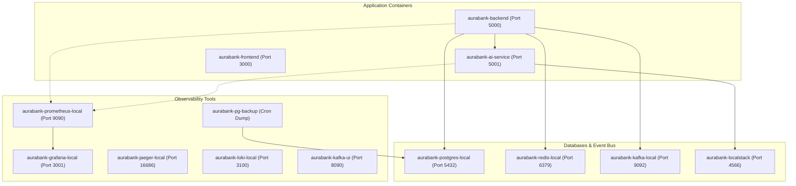

# 🐳 Docker & Docker Compose Deep-Dive Guide

> **AuraBank Platform — Interview Containerization & Orchestration Reference**

---

## 🏗️ 1. Multi-Stage Docker Build Strategy

### Node.js Backend Dockerfile (`backend/Dockerfile`):
```dockerfile
# ── Stage 1: TypeScript Build Builder ─────────────────────────
FROM node:20-alpine AS builder
WORKDIR /build
COPY package*.json tsconfig.json ./
RUN npm ci --legacy-peer-deps
COPY src/ src/
RUN npm run build 2>/dev/null || npx tsc --outDir dist 2>/dev/null || true

# ── Stage 2: Production Lean Runtime ─────────────────────────
FROM node:20-alpine AS production
WORKDIR /app
COPY --chown=node:node package*.json ./
RUN npm ci --omit=dev --legacy-peer-deps
COPY --chown=node:node --from=builder /build/dist ./dist
COPY --chown=node:node --from=builder /build/src ./src
COPY --chown=node:node tsconfig.json ./
ENV NODE_ENV=production
USER node
EXPOSE 5000
HEALTHCHECK --interval=15s --timeout=5s --start-period=10s --retries=3 \
  CMD node -e "require('http').get('http://localhost:5000/health', (r) => { if (r.statusCode === 200) process.exit(0); else process.exit(1); })" || exit 1
CMD ["npm", "start"]
```

---

## 🐙 2. Docker Compose Infrastructure Stack (`docker-compose.local.yaml`)



---

## 🔧 3. Practical Container Troubleshooting Commands

```bash
# Start all services in background
docker compose -f docker-compose.local.yaml up -d --build

# View container status and health
docker ps --format "table {{.Names}}\t{{.Status}}\t{{.Ports}}"

# Inspect live container logs
docker compose logs -f backend

# Test network ping between containers
docker exec -it aurabank-backend nc -zv postgres 5432

# Verify database backup dump
docker exec -it aurabank-pg-backup ls -la /backups

# Gracefully stop all local containers
docker compose -f docker-compose.local.yaml down
```
