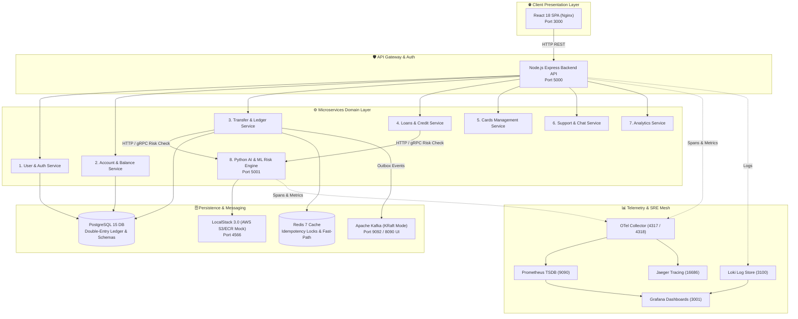
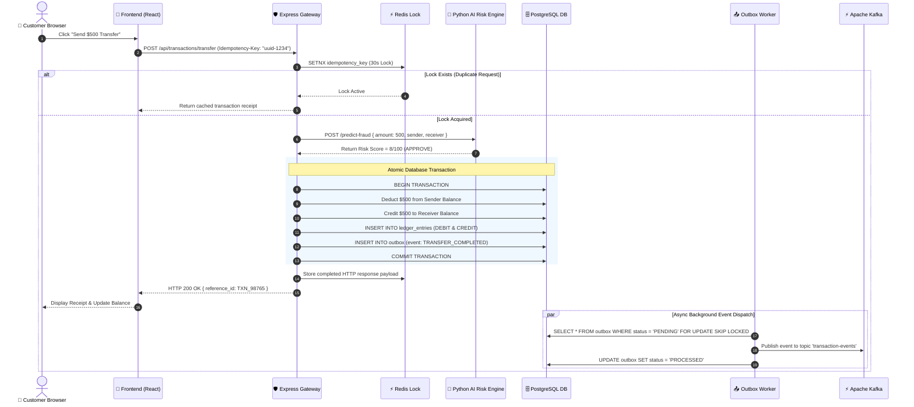
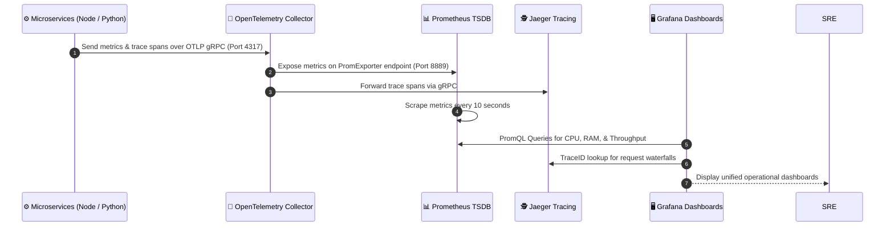

# 📐 System Design & Architecture Diagrams Guide

> **AuraBank Platform — Interview Architecture Reference**

---

## 🏗️ 1. Complete System Microservices Architecture

---

## 💸 2. Money Transfer Execution Flow

---

## 📊 3. Telemetry Collection & Observability Flow

