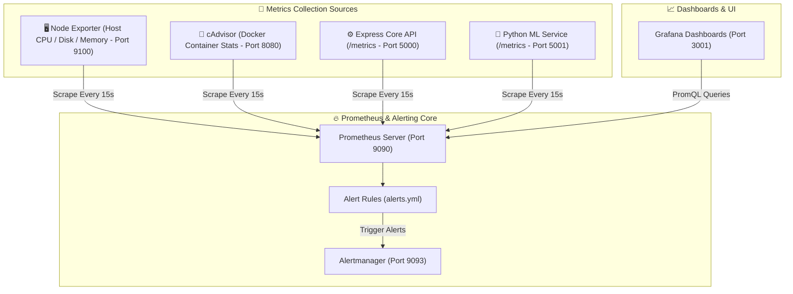

# 📊 Aura Bank - Monitoring & Observability Stack

<div align="center">


**Production Observability Infrastructure for System Health, Container Metrics, API Latency & Automated Alerting**

</div>

---

## 📖 Overview

The **Aura Bank Monitoring Stack** provides full-stack observability across the containerized microservices ecosystem. It aggregates real-time hardware metrics, container resource consumption, HTTP request latency (p50, p95, p99), database pool status, and microservice error rates into centralized Grafana dashboards and Prometheus alerting engines.

---

## 🏗️ Observability Architecture



---

## 🛠️ Stack Components & Port Matrix

| Service Component | Container Image | Host Port | Metric Target / Access Path |
| :--- | :--- | :--- | :--- |
| **Prometheus** | `prom/prometheus:v2.49.1` | `9090` | `http://localhost:9090` (PromQL Query Browser) |
| **Grafana** | `grafana/grafana:10.3.1` | `3001` | `http://localhost:3001` (User: `admin` / Pass: `admin`) |
| **Alertmanager** | `prom/alertmanager:v0.26.0` | `9093` | `http://localhost:9093` (Alert Status Interface) |
| **Node Exporter** | `prom/node-exporter:v1.7.0` | `9100` | `http://localhost:9100/metrics` (Host Hardware Metrics) |
| **cAdvisor** | `gcr.io/cadvisor/cadvisor:v0.47.2` | `8080` | `http://localhost:8080/metrics` (Container Stats) |

---

## 📈 Prometheus Target Configurations (`prometheus.yml`)

Prometheus scrapes metrics from 5 distinct service targets every 15 seconds:

```yaml
scrape_configs:
  - job_name: 'prometheus'
    static_configs:
      - targets: ['localhost:9090']

  - job_name: 'express-backend'
    static_configs:
      - targets: ['backend:5000']

  - job_name: 'flask-ai-service'
    static_configs:
      - targets: ['ai-service:5001']

  - job_name: 'node-exporter'
    static_configs:
      - targets: ['node-exporter:9100']

  - job_name: 'cadvisor'
    static_configs:
      - targets: ['cadvisor:8080']
```

---

## 🔔 Alerting Rules & Thresholds (`alerts.yml`)

Prometheus monitors system health against predefined alert conditions:

| Alert Name | Condition / Expression | Severity | Description |
| :--- | :--- | :--- | :--- |
| `ServiceDown` | `up == 0` | **Critical** | Triggers if any microservice or container goes offline for > 1 min. |
| `HighErrorRate` | `rate(http_requests_total{status=~"5.."}[5m]) > 0.05` | **Warning** | Triggers if HTTP 500 error rate exceeds 5% over 5 minutes. |
| `HighMemoryUsage` | `container_memory_usage_bytes > 500MB` | **Warning** | Triggers if a container consumes more than 500MB RAM. |
| `HighLatency` | `histogram_quantile(0.95, rate(http_request_duration_seconds_bucket[5m])) > 1` | **Warning** | Triggers if 95th percentile API response latency exceeds 1s. |

---

## 📊 Pre-Provisioned Grafana Dashboards

Grafana automatically provisions datasource and dashboard configurations on boot:

1. **System & Container Metrics Dashboard** (`system_container_metrics.json`):
   - Real-time CPU core usage per container.
   - Memory consumption (RSS / Cache) per container.
   - Network transmission rate (Bytes In / Out).
   - System load average (1m, 5m, 15m).

2. **API & Service Latency Dashboard**:
   - Total HTTP requests per minute.
   - Response status breakdown (2xx, 4xx, 5xx).
   - p50, p90, and p99 request latency curves.

---

## 🚀 Operations & Troubleshooting

### Check Prometheus Target Status via Terminal
```bash
curl -s http://localhost:9090/api/v1/targets | Select-String "health"
```

### Useful PromQL Queries
```promql
# 1. Total HTTP Requests Rate across API Gateway
rate(http_requests_total[5m])

# 2. 95th Percentile API Response Latency
histogram_quantile(0.95, sum(rate(http_request_duration_seconds_bucket[5m])) by (le))

# 3. CPU Usage per Container
rate(container_cpu_user_seconds_total[5m]) * 100
```
